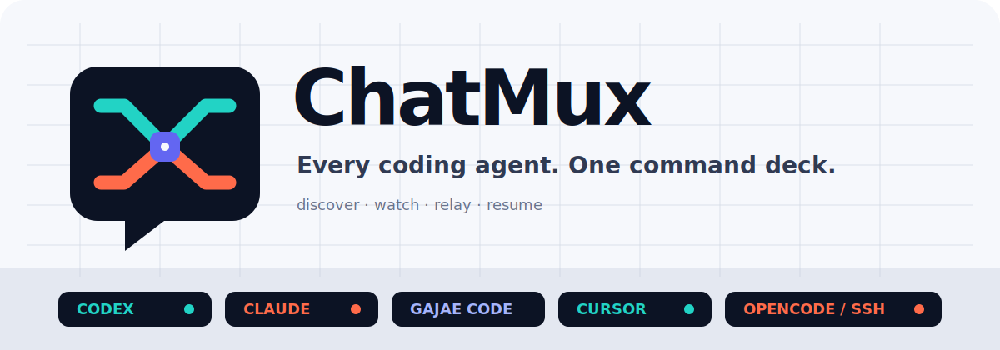
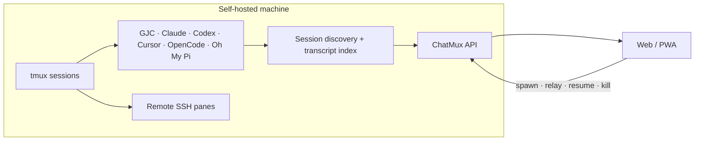

<h3 align="center">every coding agent, one command deck</h3>
<p align="center"><b>ChatMux</b> is a self-hosted web interface for discovering, reading, and controlling coding-agent sessions running in tmux.</p>

<p align="center">
  <a href="https://github.com/devswha/chatmux/releases"></a>
  <a href="LICENSE"></a>
  
  
</p>

<p align="center">
  
</p>

<p align="center">
  <a href="#install"><b>Install</b></a> ·
  <a href="#agent-support">Agent support</a> ·
  <a href="#remote-access">Remote access</a> ·
  <a href="docs/INSTALL.md">Installation guide</a> ·
  <a href="docs/SELF-HOST.md">Operations guide</a>
</p>

ChatMux turns native Gajae Code, Claude Code, Codex, Cursor, OpenCode, and Oh My Pi sessions into one working surface:

- discovers supported tmux sessions instead of requiring registration;
- opens indexed sessions as structured conversations and SSH sessions as terminals;
- relays prompts, resumes sessions, starts new agents, and stops only sessions whose ownership can be verified;
- leaves tmux sessions running when ChatMux restarts or exits;
- keeps agent connections, appearance, credentials, and remote access in one Settings screen.

Agent subscriptions are not included. Install and authenticate each CLI as the same OS user that runs ChatMux.

<a id="install"></a>
## Install

Install the latest production release on Linux x86_64:

```bash
curl -fsSL https://github.com/devswha/chatmux/releases/latest/download/install.sh | bash
```

The bootstrap verifies the release checksum, installs a private Node.js 22
runtime when needed, configures the user service, and selects Tailscale when it
is already running. Otherwise ChatMux stays local-only. The backend uses the
first free loopback port starting at `127.0.0.1:3001`.

Requirements: glibc 2.35 or newer, tmux, user-level systemd, `curl`, `tar`, and
`sha256sum`. See the [installation guide](docs/INSTALL.md) for pinned installs,
explicit access choices, paths, rollback, and recovery.

For source development:

```bash
git clone https://github.com/devswha/chatmux.git
cd chatmux
npm ci
npm run dev
```

Open <http://127.0.0.1:5173>. Development requires Node.js `22.22.2+` on the
22.x line or `24.15.0+` on the 24.x line, npm, Git, tmux, and Rust `1.85.1`.

<a id="agent-support"></a>
## Agent support

| Agent | Live discovery | Structured transcript | Input | New tmux session |
|---|---|---|---|---|
| **Gajae Code (GJC)** | Automatic | Yes | Prompt relay and `/` commands | Yes |
| **Codex CLI** | Automatic | After rollout indexing | Prompt relay and `$` skills | Yes |
| **Claude Code** | Automatic | After history indexing | Prompt relay and `/` skills | Yes |
| **Cursor** | Automatic | After history indexing | Prompt relay and `/` skills | Yes |
| **OpenCode** | Automatic | After SQLite indexing | Prompt relay and `/` skills | Yes |
| **Oh My Pi** | Automatic | After JSONL indexing | Prompt relay and `/skill:` skills | Yes |
| **SSH tmux** | Automatic | No | Attached terminal | No |

Models, reasoning levels, permissions, skills, and MCP controls appear only when
the provider CLI and its local session format expose them.

<a id="remote-access"></a>
## Remote access

The production installer can configure Tailscale Serve without exposing the
backend beyond `127.0.0.1`. Approved tailnet accounts use the private HTTPS
address without a separate ChatMux password; unapproved accounts are denied.

```bash
chatmux access users
chatmux access allow family@example.com
chatmux access revoke family@example.com
chatmux access owner new-owner@example.com
```

The installer reuses an existing ChatMux Serve front or selects an unused port
from `8443` through `8499`. It does not enable Funnel or reset unrelated Serve
configuration. Without Tailscale, use an SSH tunnel:

```bash
ssh -N -L 3001:127.0.0.1:3001 user@server
```

Then open <http://127.0.0.1:3001> locally.

## How it works



ChatMux links tmux process ancestry to native transcript identifiers. A matching
working directory alone is never enough to authorize a destructive action, and
the tmux session identifier is rechecked before relay or termination.

## Daily workflow

- Live agent rows open as conversation views before the first native transcript
  is written, then switch to indexed titles, models, and message history.
- Remote SSH rows remain attached terminals because no local transcript can be
  verified.
- Native provider stores are indexed automatically. Select a project to search
  and resume prior sessions.
- The file panel browses, previews, edits, and uploads only within a validated
  project root.

### Settings

| Tab | Controls |
|---|---|
| **Agents** | CLI installation and authentication, provider permissions, MCP, and skills |
| **Appearance** | Theme, language, thinking/raw parameters, send key, voice input, project order, and editor behavior |
| **API & Tokens** | ChatMux API keys and GitHub credentials |
| **Access** | Tailscale HTTPS address, current identity, owner, and allowed accounts |

## Development and verification

| Command | Purpose |
|---|---|
| `npm run dev` | Vite client and development backend |
| `npm run typecheck` | Client and server TypeScript checks |
| `npm test` | Server and client tests |
| `npm run lint` | ESLint for product and tooling code |
| `npm run check:identity` | Product name, storage path, and repository identity checks |
| `npm run build` | Production client, server, and Rust core build |
| `npm run verify` | Audit, types, Rust, tests, lint, identity, and production build |

```bash
npm run verify
```

## Security and data boundaries

- The backend binds to loopback. Tailscale mode trusts Serve identity headers
  only from loopback on the expected HTTPS origin and applies one allowlist to
  HTTP and WebSocket requests.
- The installer does not enable Tailscale Funnel or a public listener. Tagged
  devices and unapproved tailnet users fail closed.
- Password mode uses `HttpOnly`, `SameSite=Strict` cookies and persistent logout
  revocation.
- Credentials are not accepted in URL query parameters. External-agent APIs use
  the `X-API-Key` header.
- Project file access normalizes paths, checks symlinks, and rejects project-root
  escapes.
- State and indexes live below `~/.chatmux`. Back up `~/.chatmux/data` before
  migration or upgrade.

## Documentation

- [Production installation](docs/INSTALL.md)
- [Self-hosted operations](docs/SELF-HOST.md)
- [Product scope and roadmap](docs/ROADMAP.md)
- [Upstream provenance](docs/UPSTREAM.md)
- [Contributing](CONTRIBUTING.md)
- [Issue tracker](https://github.com/devswha/chatmux/issues)

## License

[GNU AGPL v3](LICENSE)
