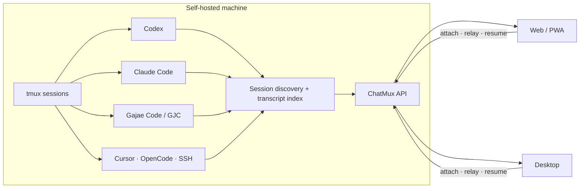

<h3 align="center">every coding agent, one command deck</h3>
<p align="center"><b>ChatMux</b>는 tmux에서 실행 중인 코딩 에이전트를 발견하고, 보고, 이어서 조작하는 셀프호스팅 웹·데스크톱 인터페이스다.</p>
<p align="center"><code>npm ci</code> · <code>npm run dev</code> · <b>localhost:5173</b></p>

<p align="center">
  <a href="https://github.com/devswha/chatmux/releases"></a>
  <a href="LICENSE"></a>
  
  
</p>

<p align="center">
  
</p>

<p align="center">
  <a href="#quick-start"><b>빠른 시작</b></a> ·
  <a href="#agent-support">에이전트 지원</a> ·
  <a href="#daily-workflow">사용 흐름</a> ·
  <a href="docs/INSTALL.md">프로덕션 설치</a> ·
  <a href="docs/SELF-HOST.md">셀프호스팅</a>
</p>

Codex, Claude Code, Gajae Code(GJC), Cursor, OpenCode를 각각 다른 창에서 추적하지 않아도 된다. ChatMux는 같은 OS 사용자로 실행 중인 네이티브 세션과 transcript를 연결해 하나의 관제면으로 만든다.

- **등록 대신 발견** — 지원 CLI가 실행 중인 tmux 세션을 주기적으로 찾는다.
- **터미널과 transcript를 한곳에** — attach가 필요한 세션은 터미널로, 구조화할 수 있는 세션은 채팅 transcript로 연다.
- **실행 상태를 즉시 확인** — GJC의 `RUN`/`LIVE`/`대기` 상태와 Codex의 세션명·모델명·tmux 이름을 표시한다.
- **세션에 직접 지시** — GJC와 Codex transcript에 메시지와 명령을 전달하고, 새 GJC/Codex/Claude tmux 세션을 만든다.
- **세션 생명주기 분리** — 세션의 주인은 tmux다. ChatMux를 재시작하거나 종료해도 외부 에이전트는 그대로 남는다.
- **한곳에서 설정** — 에이전트 연결, 표시·입력·음성 선호, API 자격 증명을 `Settings`에서 관리한다.

앱에 모델 구독은 포함되지 않는다. 사용할 CLI는 ChatMux 서버를 실행하는 **같은 OS 사용자**로 미리 설치하고 인증해야 한다.
GJC는 ChatMux의 내장 모드나 하위 제품이 아니라, Claude Code·Codex처럼 독립적으로 실행되는 **[Gajae Code](https://github.com/Yeachan-Heo/gajae-code) 코딩 에이전트**다.

## 동작 구조



ChatMux는 tmux pane의 프로세스 계보와 transcript ID를 우선 사용한다. 작업 디렉터리 일치만으로 파괴적 조작 권한을 주지 않으며, 다른 pane이나 재사용된 tmux 이름을 잘못 종료하지 않도록 세션 ID를 함께 검증한다.

<a id="agent-support"></a>
## 에이전트 지원

| 에이전트 | 실행 중 세션 | 구조화 transcript | 입력 경로 | 새 tmux 세션 |
|---|---|---|---|---|
| **Gajae Code (GJC)** | 자동 발견 | 지원 | 메시지 릴레이 + `/` 명령 | 지원 |
| **Codex CLI** | 자동 발견 | rollout 인덱싱 후 지원 | transcript 릴레이 + `$` 스킬, 인덱싱 전 터미널 | 지원 |
| **Claude Code** | 자동 발견 | 히스토리 인덱싱 후 지원 | transcript 릴레이, 인덱싱 전 터미널 | 지원 |
| **Cursor** | 히스토리 인덱싱 | 지원 | 웹 구동 채팅 | 해당 없음 |
| **OpenCode** | 히스토리 인덱싱 | 지원 | 웹 구동 채팅 | 해당 없음 |
| **SSH tmux** | 자동 발견 | 해당 없음 | attach 터미널 | 해당 없음 |

프로바이더별 모델, reasoning effort, 권한, 스킬, MCP 기능은 해당 CLI와 로컬 세션 형식이 제공할 때만 노출된다.

<a id="quick-start"></a>
## 빠른 시작

> 일상 운영에는 [프로덕션 설치 가이드](docs/INSTALL.md)의 검증된 릴리스 아티팩트를 권장한다. 아래 명령은 소스 개발용이다.

### 요구사항

- Node.js `22.22.2+`(22.x) 또는 `24.15.0+`(24.x)
- npm, Git, tmux
- 소스 빌드 시 rustup 기반 Rust `1.85.1`
- 설치·인증된 지원 에이전트 CLI 한 개 이상

```bash
git clone https://github.com/devswha/chatmux.git
cd chatmux
npm ci
npm run dev
```

브라우저에서 <http://127.0.0.1:5173>을 연다. 개발 백엔드는 `127.0.0.1:3001`에서 실행된다.

### 데스크톱 개발 실행

첫 번째 터미널에서 웹 스택을 유지하고 두 번째 터미널에서 Electron을 실행한다.

```bash
# terminal 1
npm run dev

# terminal 2
npm run desktop:dev
```

## 첫 실행

1. **노출 방식을 결정한다.** 기본값은 단일 사용자 무로그인(`CHATMUX_AUTH=none`)이며 loopback에만 바인드된다. 비밀번호 인증은 `CHATMUX_AUTH=password`로 켠다.
2. **에이전트를 연결한다.** 온보딩 또는 **Settings → Agents**에서 호스트에 설치된 CLI 상태를 확인한다.
3. **기존 세션을 연다.** 실행 중인 tmux 세션이 사이드바에 자동으로 나타난다.
4. **필요하면 새 세션을 만든다.** 사이드바의 새 세션 흐름에서 GJC, Codex, Claude와 작업 디렉터리를 선택한다.
5. **웹 구동 채팅을 사용한다.** 로컬 프로젝트를 추가하고 지원 프로바이더, 모델, 권한을 선택해 대화를 시작한다.

<a id="daily-workflow"></a>
## 일상 사용

### 라이브 세션

- GJC 행은 transcript 기반 채팅으로 열린다. 메시지 전송, 슬래시 명령, spawn, kill을 지원한다.
- Codex와 Claude Code 행은 첫 메시지 전부터 transcript형 릴레이 화면으로 열리고, 네이티브 transcript가 생성·인덱싱되면 제목·현재 모델·대화 내용이 있는 구조화 화면으로 자동 전환된다.
- 원격 SSH 행만 로컬 transcript를 확인할 수 없어 attach 터미널로 연다.
- kill과 relay는 프로세스 계보로 소유권이 증명된 tmux 세션에만 허용된다.

### 프로젝트와 히스토리

네이티브 프로바이더 세션 스토어는 자동 인덱싱된다. 프로젝트를 선택하면 과거 세션을 검색하고 재개할 수 있다. 파일 패널은 검증된 프로젝트 루트 안에서 탐색, 미리보기, 편집, 업로드를 제공한다.

### Settings

| 탭 | 관리 항목 |
|---|---|
| **Agents** | CLI 연결 상태, 프로바이더 계정과 기본 에이전트 |
| **Appearance** | 테마, 언어, thinking/raw parameter 표시, 전송 키, 음성 UI, 프로젝트 정렬, 에디터 표시 |
| **API & Credentials** | 외부 API 키, GitHub 토큰, 버전·프로젝트 정보 |

별도의 Quick Settings 패널은 없다. 표시·입력 선호는 전체 Settings에서만 변경한다.

## 원격 사용

기본 바인드는 loopback이다. 다른 기기에서는 공용 포트 노출 대신 신뢰하는 VPN 또는 SSH 터널을 사용한다.

```bash
ssh -N -L 3001:127.0.0.1:3001 user@server
```

그 뒤 로컬 브라우저에서 <http://127.0.0.1:3001>을 연다. Electron 원격 타깃은 HTTPS가 필수이며, 평문 HTTP는 정확한 loopback 오리진에만 허용된다.

## 프로덕션 설치

현재 서버 릴리스 기준 지원 대상은 glibc `2.35+` Linux x86_64, Node.js 22.x, 사용자 레벨 systemd다. [GitHub Releases](https://github.com/devswha/chatmux/releases)의 버전 고정 아티팩트와 `.sha256`을 함께 사용한다.

정확한 설치, 업그레이드, 롤백, 제거 절차:

- [프로덕션 설치](docs/INSTALL.md)
- [셀프호스팅 운영](docs/SELF-HOST.md)

## 개발과 검증

| 명령 | 용도 |
|---|---|
| `npm run dev` | Vite 클라이언트 + 개발 백엔드 |
| `npm run desktop:dev` | 개발 웹 스택에 연결하는 Electron |
| `npm run typecheck` | 클라이언트·서버 TypeScript 검사 |
| `npm test` | 서버·클라이언트·Electron 테스트 |
| `npm run lint` | 제품·도구 코드 ESLint |
| `npm run check:identity` | 제품명, 저장 경로, 저장소 정체성 검사 |
| `npm run build` | 클라이언트·서버·Rust 코어 프로덕션 빌드 |
| `npm run verify` | 감사, 타입, Rust, 테스트, lint, 정체성, 빌드 전체 게이트 |

```bash
npm run verify
```

## 보안과 데이터 경계

- 무인증 비-loopback 노출은 `CHATMUX_ALLOW_UNAUTH_REMOTE=1`로 위험을 명시하지 않는 한 거부된다.
- 비밀번호 인증은 `HttpOnly`, `SameSite=Strict` 쿠키와 영구 로그아웃 무효화를 사용한다.
- 자격 증명은 URL 쿼리로 받지 않는다. 외부 에이전트 API는 `X-API-Key` 헤더를 사용한다.
- 프로젝트 파일 접근은 정규화 경로와 심링크 검사를 거치며 루트 탈출을 거부한다.
- Electron은 원격 타깃별 세션 파티션을 분리해 쿠키와 스토리지를 공유하지 않는다.
- 상태와 인덱스는 `~/.chatmux` 아래에 저장된다. 업그레이드나 이전 전 `~/.chatmux/data`를 백업한다.

## 프로젝트 정보

- [MVP와 제품 방향](docs/MVP.md)
- [설치](docs/INSTALL.md)
- [셀프호스팅](docs/SELF-HOST.md)
- [업스트림 출처](docs/UPSTREAM.md)
- [기여 가이드](CONTRIBUTING.md)
- [이슈 트래커](https://github.com/devswha/chatmux/issues)

## 라이선스

[GNU AGPL v3](LICENSE)
