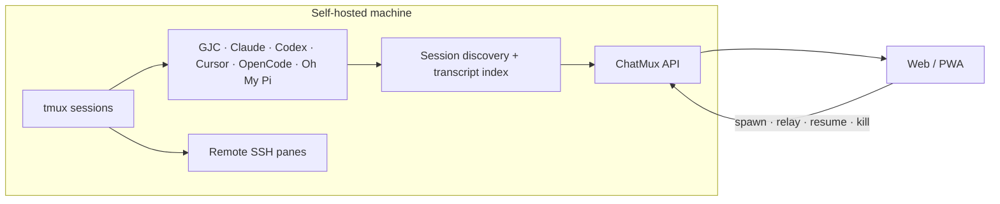

<p align="center">
  
</p>

<h3 align="center">every coding agent, one command deck</h3>
<p align="center"><b>ChatMux</b> is a self-hosted web interface for discovering, reading, and controlling coding-agent sessions running in tmux.</p>

<p align="center">
  <a href="https://github.com/devswha/chatmux/releases"></a>
  <a href="LICENSE"></a>
  
  
</p>

<p align="center">
  <a href="#install"><b>Install</b></a> ·
  <a href="#browser">Browser</a> ·
  <a href="#mobile">Mobile</a> ·
  <a href="#agent-support">Agent support</a> ·
  <a href="#remote-access">Remote access</a> ·
  <a href="docs/INSTALL.md">Installation guide</a> ·
  <a href="docs/SELF-HOST.md">Operations guide</a>
</p>

You run coding agents — Gajae Code, Claude Code, Codex, Cursor CLI, OpenCode,
Oh My Pi — inside tmux, like always. ChatMux finds them by itself and shows
every session in one browser page, on your desktop or your phone:

- **No registration.** Agents already running in tmux just appear in the sidebar.
- **One ordered sidebar.** Every provider in one drag-sortable list, with
  `RUN`, `READY`, and `ERROR` badges for live state.
- **Chat or terminal.** Recognized transcripts read as conversations; everything
  else is a real attached terminal. Input only ever reaches a pane whose
  identity ChatMux has verified.
- **tmux stays the boss.** Restart or remove ChatMux any time; your tmux
  sessions keep running untouched.

ChatMux does not bundle any AI subscription. Install and log in to each agent
CLI as the same OS user that runs ChatMux.

<a id="install"></a>
## Install

Linux x86_64 (glibc 2.35+) with tmux, user-level systemd, and
`curl`/`tar`/`sha256sum`:

```bash
curl -fsSL https://github.com/devswha/chatmux/releases/latest/download/install.sh | bash
```

<p align="center">
  
</p>

The installer downloads the canonical release archive, verifies its SHA-256,
starts a user-level service, and prints your addresses. `chatmux status` shows
them again any time. Pinned versions, access modes, updates, rollback, and
recovery are covered in the [installation guide](docs/INSTALL.md); source
development is covered in [Development](#development).

<a id="browser"></a>
## Browser

Open the printed `Local` address — running tmux agents appear in the sidebar
by themselves. Sessions with a recognized transcript render as a structured
conversation with a composer:

<p align="center">
  
</p>

The `CLI output` tab of the same session is the real TUI running inside tmux,
rendered in the browser — answer menu prompts, watch raw output, or take over
with real keystrokes:

<p align="center">
  
</p>

<a id="mobile"></a>
## Mobile

Turn on Tailscale on the phone, scan the QR code from the install output, and
use the in-app **Install app** button to keep ChatMux as a PWA.

The full roster, the conversation view, and the real TUI with a terminal key
bar all work from the phone:

<p align="center">
  
  
  
</p>

<a id="agent-support"></a>
## Agent support

"Chat view" below means the session renders as a readable conversation with a
composer; otherwise ChatMux gives you an attached terminal. Both views can
type into the real pane.

| Agent | Found automatically | Chat view | Send input | Start new session |
|---|---|---|---|---|
| **Gajae Code (GJC)** | Yes | Yes | Prompts and `/` commands | Yes |
| **Codex CLI** | Yes | After its history is indexed | Prompts and `$` skills | Yes |
| **Claude Code** | Yes | After its history is indexed | Prompts and `/` skills | Yes |
| **Cursor CLI** | Yes | After its history is indexed | Prompts and `/` skills | Yes |
| **OpenCode** | Yes | After its history is indexed | Prompts and `/` skills | Yes |
| **Oh My Pi** | Yes | After its history is indexed | Prompts and `/skill:` skills | Yes |
| **SSH tmux** | Yes | No — terminal only | Terminal keystrokes | No |
| **Local shell** | Yes | No — terminal only | Terminal keystrokes | No |

Cursor sessions use the documented `agent` command. The legacy `cursor-agent`
alias remains supported for older installations.

<a id="remote-access"></a>
## Remote access

With Tailscale logged in, the installer configures Tailscale Serve
automatically: approved tailnet accounts use the private HTTPS address with no
separate password, and everyone else is denied. Without Tailscale, installation
enables password access on the LAN with a one-time owner password:

```bash
chatmux access password              # rotate/recover (signs out all sessions)
chatmux access enable tailscale     # switch modes after Tailscale is available
```

User allowlists, longer sessions, VPN mode, SSH tunnels, and public TLS
options are covered in the [remote access guide](docs/REMOTE-ACCESS.md) and
the [installation guide](docs/INSTALL.md).

## How it works


```mermaid
flowchart LR
  subgraph Host[Self-hosted machine]
    TMUX[tmux sessions]
    AGENTS[GJC · Claude · Codex · Cursor · OpenCode · Oh My Pi]
    SSH[Remote SSH panes]
    INDEX[Session discovery + transcript index]
    API[ChatMux API]

    TMUX --> AGENTS
    TMUX --> SSH
    AGENTS --> INDEX
    INDEX --> API
  end

  API --> WEB[Web / PWA]
  WEB -->|spawn · relay · resume · kill| API
```

ChatMux links tmux process ancestry to native transcript identifiers. A matching
working directory alone is never enough to authorize a destructive action, and
the tmux session identifier is rechecked before relay or termination.

<a id="development"></a>
## Development

```bash
git clone https://github.com/devswha/chatmux.git
cd chatmux
npm ci
npm run dev
```

Open <http://127.0.0.1:5173>. Development requires Node.js `22.22.2+` on the
22.x line or `24.15.0+` on the 24.x line, npm, Git, tmux, and Rust `1.85.1`.
`npm run verify` runs the full release gate: audit, typecheck, Rust checks,
tests, lint, identity checks, and a production build.

## Security and data boundaries

- The backend binds to loopback. Tailscale mode trusts Serve identity headers
  only from loopback on the expected HTTPS origin; the installer never enables
  Funnel or a public listener, and unapproved users fail closed.
- Password mode uses `HttpOnly`, `SameSite=Strict` cookies with persistent
  logout revocation.
- State and indexes live below `~/.chatmux`. Back up `~/.chatmux/data` before
  migration or upgrade.

## Documentation

- [Production installation](docs/INSTALL.md)
- [Remote access](docs/REMOTE-ACCESS.md)
- [Self-hosted operations](docs/SELF-HOST.md)
- [Product scope and roadmap](docs/ROADMAP.md)
- [Upstream provenance](docs/UPSTREAM.md)
- [Contributing](CONTRIBUTING.md)
- [Issue tracker](https://github.com/devswha/chatmux/issues)

## License

[GNU AGPL v3](LICENSE)
