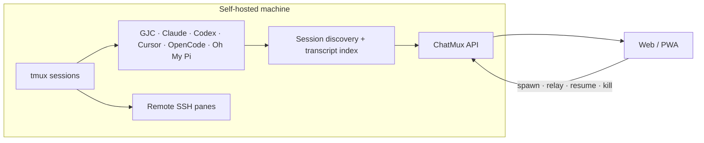

<p align="center">
  
</p>

<p align="center"><sub><b>English</b> · <a href="docs/readme/README.ko.md">한국어</a> · <a href="docs/readme/README.ja.md">日本語</a> · <a href="docs/readme/README.zh-CN.md">简体中文</a></sub></p>

<p align="center"><b>ChatMux</b> is a self-hosted web interface for discovering, reading, and controlling<br>coding-agent sessions running in tmux — from your desktop or your phone.</p>

<p align="center">
  <a href="https://github.com/devswha/chatmux/releases"></a>
  <a href="LICENSE"></a>
  
  
</p>

<p align="center">
  <a href="#install"><b>Install</b></a>
  &nbsp;·&nbsp;
  <a href="#browser"><b>Browser</b></a>
  &nbsp;·&nbsp;
  <a href="#mobile"><b>Mobile</b></a>
  &nbsp;·&nbsp;
  <a href="#agent-support"><b>Agent support</b></a>
  &nbsp;·&nbsp;
  <a href="#remote-access"><b>Remote access</b></a>
  &nbsp;·&nbsp;
  <a href="docs/INSTALL.md"><b>Docs</b></a>
</p>

<br>

You run coding agents — Gajae Code, Claude Code, Codex, Cursor CLI, OpenCode,
Oh My Pi — inside tmux, like always. ChatMux finds them by itself and shows
every session in one browser page:

<table align="center">
  <tr>
    <td width="50%" valign="top">
      <b>No registration</b><br>
      <sub>Agents already running in tmux just appear in the sidebar. Nothing to wrap, wire, or restart.</sub>
    </td>
    <td width="50%" valign="top">
      <b>One ordered sidebar</b><br>
      <sub>Every provider in a single drag-sortable list, with <code>RUN</code>, <code>READY</code>, and <code>ERROR</code> badges for live state.</sub>
    </td>
  </tr>
  <tr>
    <td width="50%" valign="top">
      <b>Chat or terminal</b><br>
      <sub>Recognized transcripts read as conversations; everything else is a real attached terminal. Input only ever reaches a pane whose identity ChatMux has verified.</sub>
    </td>
    <td width="50%" valign="top">
      <b>tmux stays the boss</b><br>
      <sub>Restart or remove ChatMux any time; your tmux sessions keep running untouched.</sub>
    </td>
  </tr>
</table>

<p align="center"><sub>ChatMux does not bundle any AI subscription — install and log in to each agent CLI as the same OS user that runs ChatMux.</sub></p>

<a id="install"></a>
## Install

Linux x86_64 (glibc 2.35+) with tmux, user-level systemd, and
`curl`/`tar`/`sha256sum`:

```bash
curl -fsSL https://github.com/devswha/chatmux/releases/latest/download/install.sh | bash
```

<p align="center">
  
  <br>
  <sub>One command: verified download, a user-level service, your addresses, and a QR for the phone.</sub>
</p>

The installer downloads the canonical release archive, verifies its SHA-256,
starts a user-level service, and prints your addresses. `chatmux status` shows
them again any time. Pinned versions, access modes, updates, rollback, and
recovery are covered in the [installation guide](docs/INSTALL.md); source
development is covered in [Development](#development).

<a id="browser"></a>
## Browser

Open the printed `Local` address — running tmux agents appear in the sidebar
by themselves. Sessions with a recognized transcript render as a structured
conversation with a composer:

<p align="center">
  
  <br>
  <sub>The conversation view: cross-provider sidebar on the left, structured transcript and composer on the right.</sub>
</p>

The `CLI output` tab of the same session is the real TUI running inside tmux,
rendered in the browser — answer menu prompts, watch raw output, or take over
with real keystrokes:

<p align="center">
  
  <br>
  <sub>The same session as a real terminal — because sometimes you need the actual TUI.</sub>
</p>

<a id="mobile"></a>
## Mobile

Turn on Tailscale on the phone, scan the QR code from the install output, and
use the in-app **Install app** button to keep ChatMux as a PWA:

<table align="center">
  <tr>
    <td align="center">
      <br>
      <sub>The full session roster</sub>
    </td>
    <td align="center">
      <br>
      <sub>Conversation view</sub>
    </td>
    <td align="center">
      <br>
      <sub>Real TUI with a key bar</sub>
    </td>
  </tr>
</table>

<a id="agent-support"></a>
## Agent support

"Chat view" below means the session renders as a readable conversation with a
composer; otherwise ChatMux gives you an attached terminal. Both views can
type into the real pane.

| Agent | Found automatically | Chat view | Send input | Start new session |
|---|:---:|---|---|:---:|
| **Gajae Code (GJC)** | Yes | Yes | Prompts and `/` commands | Yes |
| **Codex CLI** | Yes | After its history is indexed | Prompts and `$` skills | Yes |
| **Claude Code** | Yes | After its history is indexed | Prompts and `/` skills | Yes |
| **Cursor CLI** | Yes | After its history is indexed | Prompts and `/` skills | Yes |
| **OpenCode** | Yes | After its history is indexed | Prompts and `/` skills | Yes |
| **Oh My Pi** | Yes | After its history is indexed | Prompts and `/skill:` skills | Yes |
| **SSH tmux** | Yes | No — terminal only | Terminal keystrokes | No |
| **Local shell** | Yes | No — terminal only | Terminal keystrokes | No |

<sub>Cursor sessions use the documented <code>agent</code> command; the legacy <code>cursor-agent</code> alias remains supported for older installations.</sub>

<a id="remote-access"></a>
## Remote access

With Tailscale logged in, the installer configures Tailscale Serve
automatically: approved tailnet accounts use the private HTTPS address with no
separate password, and everyone else is denied. Without Tailscale, installation
enables password access on the LAN with a one-time owner password:

```bash
chatmux access password              # rotate/recover (signs out all sessions)
chatmux access enable tailscale     # switch modes after Tailscale is available
```

User allowlists, longer sessions, VPN mode, SSH tunnels, and public TLS
options are covered in the [remote access guide](docs/REMOTE-ACCESS.md) and
the [installation guide](docs/INSTALL.md).

## How it works


```mermaid
flowchart LR
  subgraph Host[Self-hosted machine]
    TMUX[tmux sessions]
    AGENTS[GJC · Claude · Codex · Cursor · OpenCode · Oh My Pi]
    SSH[Remote SSH panes]
    INDEX[Session discovery + transcript index]
    API[ChatMux API]

    TMUX --> AGENTS
    TMUX --> SSH
    AGENTS --> INDEX
    INDEX --> API
  end

  API --> WEB[Web / PWA]
  WEB -->|spawn · relay · resume · kill| API
```

ChatMux links tmux process ancestry to native transcript identifiers. A matching
working directory alone is never enough to authorize a destructive action, and
the tmux session identifier is rechecked before relay or termination.

<a id="development"></a>
## Development

```bash
git clone https://github.com/devswha/chatmux.git
cd chatmux
npm ci
npm run dev
```

Open <http://127.0.0.1:5173>. Development requires Node.js `22.22.2+` on the
22.x line or `24.15.0+` on the 24.x line, npm, Git, tmux, and Rust `1.85.1`.
`npm run verify` runs the full release gate: audit, typecheck, Rust checks,
tests, lint, identity checks, and a production build.

## Security and data boundaries

- The backend binds to loopback. Tailscale mode trusts Serve identity headers
  only from loopback on the expected HTTPS origin; the installer never enables
  Funnel or a public listener, and unapproved users fail closed.
- Password mode uses `HttpOnly`, `SameSite=Strict` cookies with persistent
  logout revocation.
- State and indexes live below `~/.chatmux`. Back up `~/.chatmux/data` before
  migration or upgrade.

## Documentation

- [Production installation](docs/INSTALL.md)
- [Remote access](docs/REMOTE-ACCESS.md)
- [Self-hosted operations](docs/SELF-HOST.md)
- [Product scope and roadmap](docs/ROADMAP.md)
- [Upstream provenance](docs/UPSTREAM.md)
- [Contributing](CONTRIBUTING.md)
- [Issue tracker](https://github.com/devswha/chatmux/issues)

<p align="center">
  <sub><a href="LICENSE">GNU AGPL v3</a> · built for people who live in tmux</sub>
</p>
