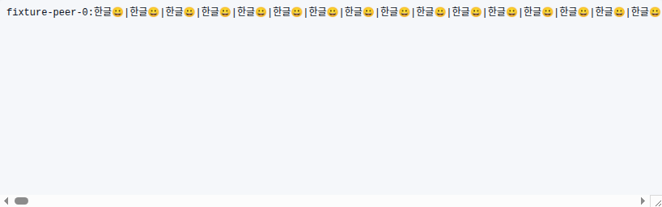
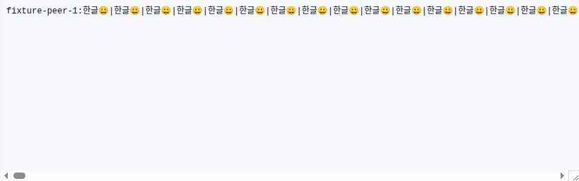

# 적대적 코드리뷰와 E2E 검증 — 2026-09-04 (UTC)

## 범위와 기준

시작 기준은 `origin/main`의 `dddc90ed89c10150bb260c4847d39767949ff33d`다.
기존 SSH·DB 미커밋 작업은 보존하고 별도 worktree에서 검토·수정했다.
`server`, `src`, `shared`, `native`, `scripts`를 목록화한 뒤 외부 입력, 권한 수명,
동시 실행, host/session/pane identity, 비동기 응답 순서를 중심으로 검토했다.
코드상 의심을 실행 가능한 실패 사례로 구분했으며, 기존 테스트의 성공 여부뿐
아니라 실제 실행 대상과 assertion이 요구 동작을 검증하는지도 확인했다.

| 검토 영역 | 확인한 경계와 근거 |
|---|---|
| HTTP/인증/WebSocket | Origin/Host guard, 쿠키·JWT, 로그아웃 token version, Tailscale principal/role, 열린 socket의 입력·출력과 대기 중 실행 |
| tmux/provider 제어 | fresh verifier, 결합 등급, pane/process generation, 보호 대상, typed attach, 부모 환경, 실제 PTY 입력·resize·종료 |
| Fleet | pairing·revocation, single-use token, generation, 요청/응답 target, mutation uncertainty, terminal lease, read deadline·frame 크기 |
| UI/store | host-qualified route/store, provider 명령·prompt, 늦은 응답, 동일 ID의 다른 host, remount key, 파일 mention·전체 출력 |
| 파일/assets | 프로젝트 containment, symlink 방어, HTML/SVG 실행 문맥, 이미지 MIME/다운로드, raw file 오류 응답 |
| DB/알림 | migration journal·transaction, role integrity, outbox claim·acknowledgement·retry, host-safe completion identity |
| 설치/updater/Rust | archive path/link/size 검사, atomic cutover·rollback state, lock ownership, native frame bounds·watcher overflow·directory FD traversal |
| 검증 도구 | 실제 수집되는 테스트 파일, 초기 DB 의존성, worker thread loader, fixture 격리, 실제 지연/오류 주입, resize 완료 신호 |

## 확인한 문제와 수정

| 우선순위 | 문제 | 수정 및 증거 |
|---|---|---|
| P1 | 로그아웃 이후 기존 WebSocket이 승인 요청을 계속 처리하고 출력을 받음 | transport의 message/send에서 현재 인증·principal/role 재검증, token revocation 시 닫기, 대기 중 discovery/attach 이후 재확인. 실제 HTTP logout + 열린 WS의 두 실패를 재현하고 권한 변경·store failure·pending spawn까지 검증 |
| P1 | 원격 전체 도구 출력 버튼이 hub의 로컬 API를 호출 | host-qualified endpoint와 `session.read` chunk 경로 추가. 동일 session/tool ID의 두 peer에서 각자의 전체 결과만 복원. 실제 Chrome 버튼과 전체 RPC 경로 검증 |
| P1 | Fleet 응답이 요청 ID/generation만 맞으면 다른 target이어도 수락 | read, mutation, terminal에서 target 전체 비교. 잘못된 mutation ACK는 `HOST_COMMAND_OUTCOME_UNKNOWN`으로 남기고 재전송하지 않음. 잘못된 session/pane generation 응답 주입 테스트 |
| P1 | 프로젝트 HTML/SVG를 직접 열면 앱 origin의 실행 문서가 됨 | raw content에 `Content-Security-Policy: sandbox`, `nosniff` 적용. 실제 Chrome에서 script sentinel이 실행되지 않음을 확인 |
| P2 | provider/host/프로세스 변경 중 이전 명령 또는 prompt가 표시됨 | 결과를 요청 scope에 묶고 현재 scope와 다르면 즉시 숨김. 실패한 선택적 skills 조회가 알려진 built-in/custom 명령을 버리지 않도록 처리 |
| P2 | relay remount key가 host/socket/PID 일부를 누락 | 기존 injective host key helper로 전체 tmux/process identity를 사용. 시작 시간이 같아도 host·socket·session·window·PID가 다르면 분리 |
| P2 | 원격 파일 mention이 동일 cwd의 hub 프로젝트를 조회 | Fleet 계약에 없는 remote file-tree 조회가 hub로 폴백하지 않도록 차단. 원격 scope에서 hub projects/files 요청이 발생하지 않는 회귀 테스트 |
| P2 | 동일 SSH target의 동시 prepare가 둘 다 통과 | 첫 await 전 target 예약, port 선택 시 즉시 예약, 공유 키 초기화 single-flight. 동일 target, 서로 다른 target의 키/port 경쟁, 초기화 실패 후 재시도 검증 |
| P2 | verified attach가 hosting tmux 환경을 상속 | child의 `TMUX`/`TMUX_PANE`만 제거하고 parent는 보존. 서버가 만든 정확한 attach argv와 환경 검사 |
| P2 | 없는 raw file이 500으로 응답 | 404로 정정하고 오류 문구를 고정. 기존 파일 읽기·쓰기·이미지 bytes 계약 유지 |

전체 출력의 추가 read selector는 구현 전에 [Fleet RFC revision 5](../docs/FLEET-FEDERATION-RFC.md)에
기록했다. 64 KiB wire bound는 유지하며, JSON escaping 여유를 둔 8 KiB UTF-8
chunk를 사용한다. revision·offset·target을 검증하고, private snapshot cache는
32 MiB/64개/60초로 제한한다. 오래된 peer의 미지원 응답은 명시적 실패로 남는다.
browser 전환은 진행 중 요청을 취소하고 늦은 결과를 현재 화면에 반영하지 않는다.

## 검증 체계에서 발견한 문제

- `shared/`의 두 계약 테스트와 여섯 `.test.mjs` 파일이 기본 `npm test`에 없었다.
  inventory에 포함하고 실행기 자체를 회귀 테스트에 넣었다. 과거의 opaque-body
  assertion은 RFC revision 3에 맞게 정정했으며 descriptor/envelope 검사는 유지했다.
- 일부 테스트가 개발자 DB에 이미 있는 schema에 의존했다. 각 server test process에
  초기화된 임시 DB를 제공하고 종료 시 정리한다. 실제 자식 테스트 실행 marker와
  ambient DB 보존을 확인한다. 명시적 Worker thread fixture는 자체 DB/TS loader를
  유지한다. Node 22 CI에서 드러난 worker preload 문제도 이 경계에서 수정했다.
- 기존 "out-of-order" mock은 동기 wait로 Playwright 이벤트 루프를 막아 실제 역전
  순서를 보장하지 않았다. 이전 요청을 보류한 채 새 provider 응답을 완료한 다음
  해제하고, completion 순서도 assertion으로 확인한다.
- 드래그 종료 직후의 click suppression, 다른 palette를 쓰는 live GJC를 app skills
  실패 대상으로 삼는 문제, 금지된 `/tmp` project fixture를 정정했다. 드래그 검증은
  마지막에 수행하며, app catalog 실패는 별도의 inactive session에서 검증한다.
- tmux layout 수치 변경은 kernel PTY resize 완료보다 빨랐다. 전용 tmux/bash 설정과
  shell의 SIGWINCH 신호를 사용해 완료를 기다린 뒤 `stty` 및 입력을 확인한다.
  resize assertion을 삭제하거나 sleep/강제 클릭으로 통과시키지 않았다.

검증 기반은 #109, 권한·실행 경계는 #110으로 분리했다. 나머지 host/UI 격리 변경과
이 보고서는 후속 PR로 검증한다. 모든 병합은 최신 main의 필수 검사 후 squash한다.

## 실행 결과

- `npm run verify`: audit 0건, TypeScript, Rust 검사, server 1,513개,
  실제 tmux/PTY 50개, client 535개, Rust 29개 테스트, lint, identity, production
  build 통과. 실패·skip 0개. 복구된 shared/ESM 검사도 포함한다.
- `npm run cua:ui:evidence`: 실제 headless Chrome에서 20개 검사 통과.
  desktop/mobile, local/remote chat·terminal, offline/resync/incompatible,
  notification deep link, HTML/SVG sandbox, full-tool-output chunk/host 격리 포함.
- `npm run cua:ui:interactions`: 생성·전환·재정렬·중단·오류 표시 및 provider/workspace
  catalog 격리·실제 응답 순서 역전·HTTP 500 fallback의 10개 검사 통과.
- 별도의 3-process Fleet E2E에서도 64 KiB를 넘는 Unicode/control-character
  도구 결과를 여러 chunk로 읽고, 동일 ID의 다른 peer와 hub가 섞이지 않음을 검증했다.
- fixture 정리 기록의 `cleanupError`는 null이며 해당 roots와 browser listeners가
  제거됐음을 확인했다. 운영 tmux 작업과 기존 미커밋 작업은 정리 대상이 아니다.

아래 이미지는 실제 E2E가 읽은 readonly 전체 출력 영역만 캡처했다. 내용은 fixture
데이터이며, 서로 다른 peer의 동일 ID 결과가 구분되는 예시다.

## 검증 한계

- 격리 GNOME의 OS/PWA 단계는 페이지 탐색을 완료하지 못하고 timeout이 발생했다.
  따라서 `cua:release` 전체 성공이나 release-grade OS/PWA 증거를 주장하지 않는다.
  통과한 실제 웹 E2E 결과와 이 실패를 구분한다. localhost/IPv4 변경 실험은 같은
  실패를 보여 유지하지 않았다.
- 실제 운영 계정의 SSH 등록, 외부 모델 API 호출, 릴리스 발행·운영 서비스
  재시작은 수행하지 않았다. agent 동작은 문서화된 fake CLI와 격리된 실제 tmux로
  검증했다. 이 보고서는 수동 검토한 경계와 실행한 시나리오의 증거를 기록한다.
