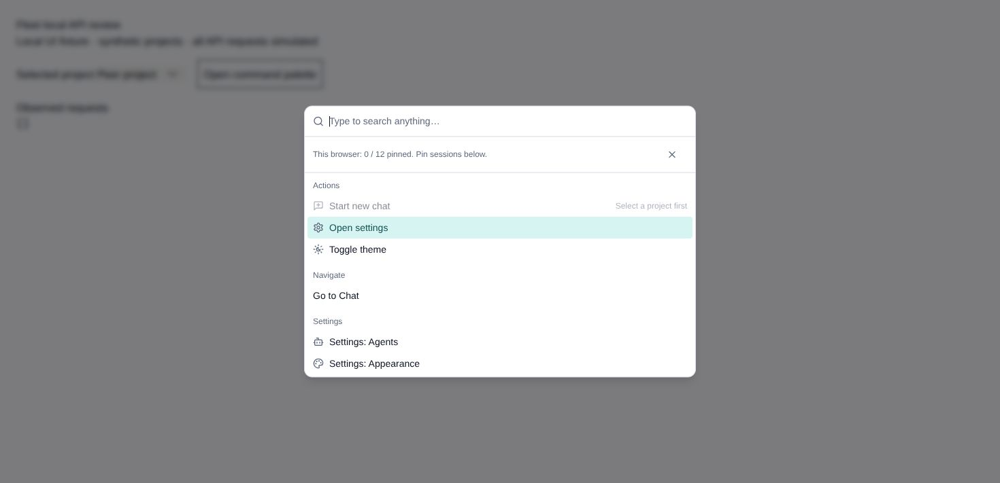
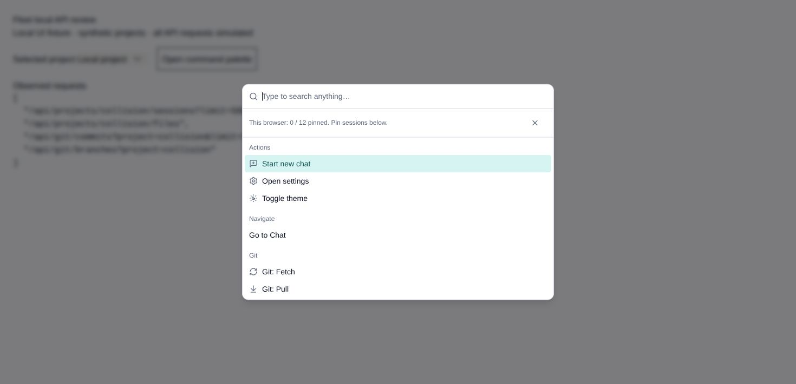

# Preserved Fleet changes: local API verification

Reviewed against `1c933a39e452b3936afc605173f8c384a565c2c0` on 2026-09-06.

The preserved `103e70b` proposal identified local-only API consumers. Current
`main` already blocks remote relay file catalogs, but ordinary file mentions,
file-link resolution, token usage, and command-palette file/Git operations still
used the hub endpoints. Two mounted regressions reproduced requests to the hub's
same-ID project and an editor opening after selection moved to a peer.

The correction requires both the current route and selected project to be local,
invalidates stale file/Git callbacks, ignores late token/file responses, and hides
the local editor when its owning project is no longer selected. Remote token
usage continues to come from host-qualified transcript history. No new Fleet
capability or peer file/Git operation is introduced.

## Reproduce the browser check

```sh
npm run client -- --host 127.0.0.1 --port 4342 --strictPort
```

Open `/scripts/cua/fleet-local-api-fixture.html` on that local Vite origin. This
mounts the production command palette with synthetic same-ID projects and
simulated responses; it never calls a real backend or changes Git repositories.

1. Select **Peer project** and open the palette: observed requests stay `[]`;
   no local files, commits, branches, or Git actions appear.
2. Close it, select **Local project**, and reopen: the existing local session,
   file, commit, and branch endpoints are requested and their rows are visible.
3. Return to the peer and reopen: local rows disappear and requests again stay
   `[]`. Local new-chat creation is unavailable on the peer.

These three interactions were verified in Chrome. This is browser component
evidence with simulated API responses, not release-grade CUA or a real peer test.




Mounted tests cover same-ID peers, absent locality evidence, delayed response
bodies, host transitions, stale action callbacks, local success/failure, and
retained local basename/diff resolution. The existing follow-tail tests also pass;
the preserved `2084ad0` design was already adopted and extended by PR #99.
