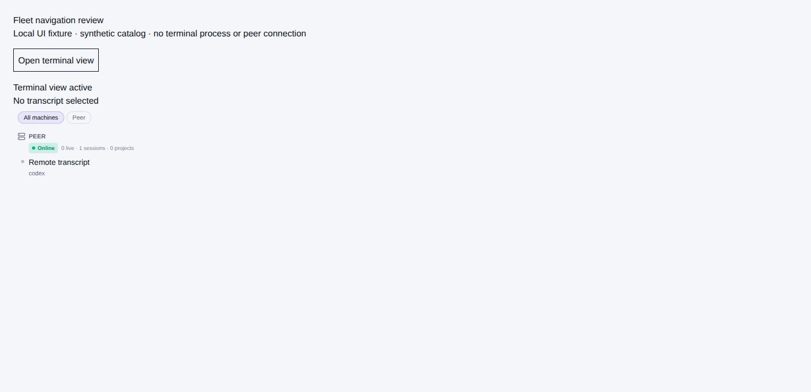
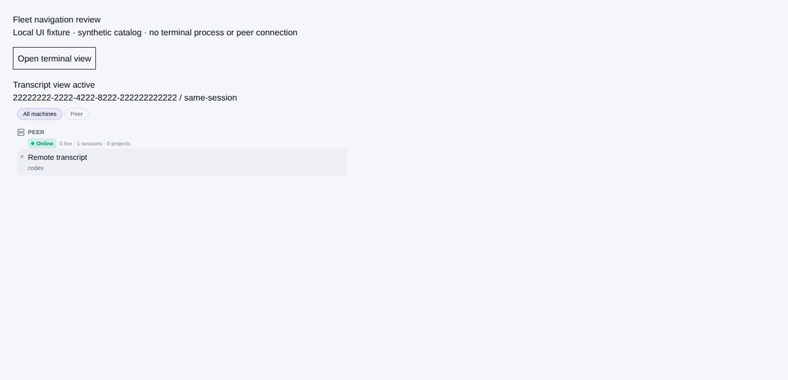

# Remote transcript selection

The preserved `c5b2636` proposal identified a real app-shell handoff defect:
remote sidebar rows navigated directly, bypassing the local sidebar's terminal
cleanup. Selecting a catalogued peer transcript left the previous terminal view
active, including when the requested route was already selected.

A mounted test now clicks the production remote sidebar row while both external
view states exist. It reproduced the retained terminal on the baseline and passes
after routing selection through the app-shell controller. The controller clears
both states and forwards the exact host-qualified session reference. Unavailable
hosts and stale rows retain their existing disabled behavior.

Remote routes whose session is missing from the catalog no longer fall back to
the previously selected local project/session. The catalog's absence remains
authoritative: the historical proposal to synthesize an uncatalogued selection is
not adopted, under the Fleet RFC's omitted-row policy.

## Browser reproduction

Run Vite on port 4342 and open `/scripts/cua/fleet-navigation-fixture.html`.
The fixture uses the production sidebar and app-shell state hook, a synthetic
catalog, and no real terminal process or peer connection.

1. Click **Open terminal view**: the status becomes **Terminal view active**.
2. Click **Open 'Remote transcript' on Peer**: the status becomes **Transcript view
   active**, and the exact peer/session reference appears.

Chrome verified this transition. The fixture starts on that same transcript route
to exercise explicit selection even when a route-change effect would not run.
This is component browser evidence, not release-grade CUA.

