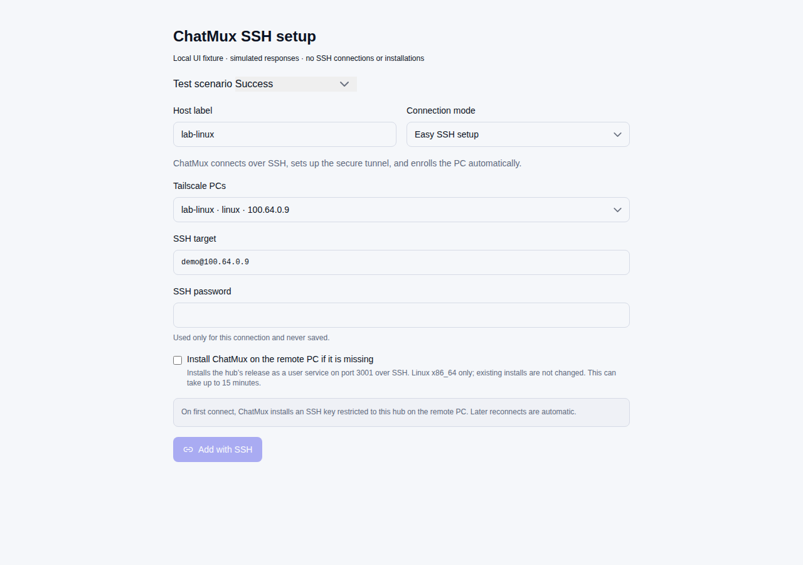
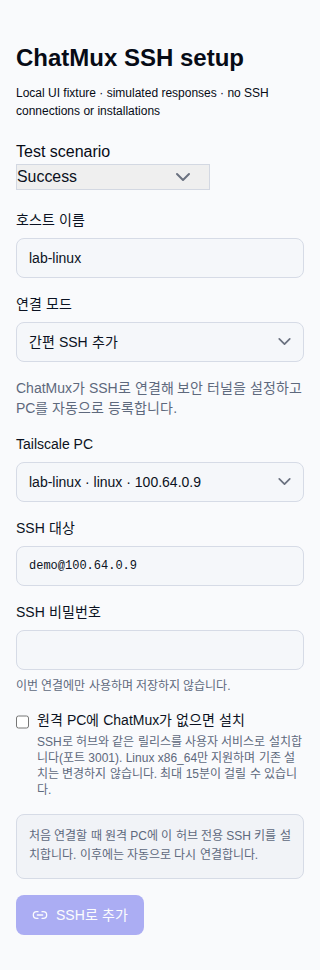

# SSH setup UI verification

These images show the production enrollment components in a local fixture with
simulated responses. No real SSH connection, remote installation, or credential
was used. The mobile cases use Chromium viewport emulation; this is not physical
phone or release-grade CUA evidence.

The matrix covers English desktop (1280×900), English mobile (390×844), and Korean
mobile (320×844): candidate pre-fill, default-off installation, explicit opt-in,
cleared passwords, success, missing CLI, unsupported platform, installation
failure, network failure, and horizontal overflow.

With the documented CUA Python/Playwright environment available, reproduce from
the repository root:

```sh
npm run client -- --host 127.0.0.1 --port 4341 --strictPort
# In another terminal:
python3 scripts/cua/ssh-bootstrap-ui.py --base-url http://127.0.0.1:4341
```




