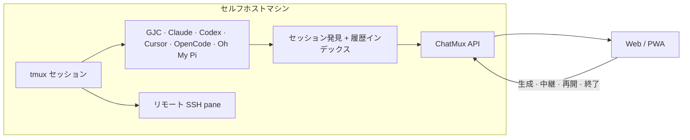

<p align="center">
  
</p>

<p align="center"><sub><a href="../../README.md">English</a> · <a href="README.ko.md">한국어</a> · <b>日本語</b> · <a href="README.zh-CN.md">简体中文</a></sub></p>

<p align="center"><b>ChatMux</b> は、tmux 内で動くコーディングエージェントのセッションを発見・閲覧・操作する<br>セルフホスト型 Web インターフェースです — デスクトップからもスマホからも。</p>

<p align="center">
  <a href="https://github.com/devswha/chatmux/releases"></a>
  <a href="../../LICENSE"></a>
  
  
</p>

<p align="center">
  <a href="#install"><b>インストール</b></a>
  &nbsp;·&nbsp;
  <a href="#browser"><b>ブラウザ</b></a>
  &nbsp;·&nbsp;
  <a href="#mobile"><b>モバイル</b></a>
  &nbsp;·&nbsp;
  <a href="#agent-support"><b>エージェント対応</b></a>
  &nbsp;·&nbsp;
  <a href="#remote-access"><b>リモートアクセス</b></a>
  &nbsp;·&nbsp;
  <a href="../INSTALL.md"><b>ドキュメント</b></a>
</p>

<br>

Gajae Code、Claude Code、Codex、Cursor CLI、OpenCode、Oh My Pi —
コーディングエージェントはこれまでどおり tmux の中で動かしてください。
ChatMux が自動で見つけ出し、すべてのセッションをブラウザの 1 ページに
表示します:

<table align="center">
  <tr>
    <td width="50%" valign="top">
      <b>登録不要</b><br>
      <sub>tmux ですでに動いているエージェントがそのままサイドバーに現れます。ラップも配線も再起動も不要です。</sub>
    </td>
    <td width="50%" valign="top">
      <b>ひとつの整列サイドバー</b><br>
      <sub>すべてのプロバイダーがドラッグで並べ替えられるひとつのリストに集まり、<code>RUN</code>・<code>READY</code>・<code>ERROR</code> バッジがライブ状態を示します。</sub>
    </td>
  </tr>
  <tr>
    <td width="50%" valign="top">
      <b>チャットまたはターミナル</b><br>
      <sub>履歴を認識できたセッションは会話として読め、それ以外は本物のターミナルとして接続されます。入力は ChatMux が同一性を検証した pane にしか届きません。</sub>
    </td>
    <td width="50%" valign="top">
      <b>主導権は tmux に</b><br>
      <sub>ChatMux はいつでも再起動・削除できます。tmux のセッションはそのまま動き続けます。</sub>
    </td>
  </tr>
</table>

<p align="center"><sub>ChatMux に AI サブスクリプションは含まれません — 各エージェント CLI は ChatMux を動かす OS ユーザーでインストールしてログインしてください。</sub></p>

<a id="install"></a>
## インストール

Linux x86_64 (glibc 2.35+)、tmux、ユーザーレベル systemd、
`curl`/`tar`/`sha256sum` が必要です:

```bash
curl -fsSL https://github.com/devswha/chatmux/releases/latest/download/install.sh | bash
```

<p align="center">
  
  <br>
  <sub>コマンド 1 行で: 検証済みダウンロード、ユーザーレベルのサービス、アクセス先アドレス、スマホ用の QR まで。</sub>
</p>

インストーラーは正規のリリースアーカイブをダウンロードして SHA-256 を
検証し、ユーザーレベルのサービスを起動してアドレスを表示します。アドレスは
`chatmux status` でいつでも再表示できます。バージョン固定、アクセスモード、
アップデート、ロールバック、リカバリは[インストールガイド](../INSTALL.md)を、
ソース開発は[開発](#development)を参照してください。

<a id="browser"></a>
## ブラウザ

表示された `Local` アドレスを開くと、動作中の tmux エージェントが自動で
サイドバーに現れます。履歴を認識できたセッションは、コンポーザー付きの
構造化された会話としてレンダリングされます:

<p align="center">
  
  <br>
  <sub>会話ビュー: 左はプロバイダー横断のサイドバー、右は構造化された履歴とコンポーザー。</sub>
</p>

同じセッションの `CLI output` タブは、tmux 内で実際に動いている TUI を
ブラウザにそのまま描画します — メニュープロンプトに答え、生の出力を
見守り、実際のキー入力で直接操作できます:

<p align="center">
  
  <br>
  <sub>同じセッションを本物のターミナルで — 結局、実物の TUI が必要な瞬間があるから。</sub>
</p>

<a id="mobile"></a>
## モバイル

スマホで Tailscale をオンにし、インストール出力の QR コードをスキャンして、
アプリ内の **Install app** ボタンで ChatMux を PWA として保存します:

<table align="center">
  <tr>
    <td align="center">
      <br>
      <sub>全セッション一覧</sub>
    </td>
    <td align="center">
      <br>
      <sub>会話ビュー</sub>
    </td>
    <td align="center">
      <br>
      <sub>キーバー付きの本物の TUI</sub>
    </td>
  </tr>
</table>

<a id="agent-support"></a>
## エージェント対応

以下の「チャットビュー」は、セッションがコンポーザー付きの読みやすい会話
としてレンダリングされることを意味します。それ以外はターミナルとして
接続されます。どちらのビューからも実際の pane に入力できます。

| エージェント | 自動検出 | チャットビュー | 入力送信 | 新規セッション |
|---|:---:|---|---|:---:|
| **Gajae Code (GJC)** | 対応 | 対応 | プロンプトと `/` コマンド | 対応 |
| **Codex CLI** | 対応 | 履歴インデックス後 | プロンプトと `$` スキル | 対応 |
| **Claude Code** | 対応 | 履歴インデックス後 | プロンプトと `/` スキル | 対応 |
| **Cursor CLI** | 対応 | 履歴インデックス後 | プロンプトと `/` スキル | 対応 |
| **OpenCode** | 対応 | 履歴インデックス後 | プロンプトと `/` スキル | 対応 |
| **Oh My Pi** | 対応 | 履歴インデックス後 | プロンプトと `/skill:` スキル | 対応 |
| **SSH tmux** | 対応 | 非対応 — ターミナルのみ | ターミナルキー入力 | 非対応 |
| **ローカルシェル** | 対応 | 非対応 — ターミナルのみ | ターミナルキー入力 | 非対応 |

<sub>Cursor セッションは公式の <code>agent</code> コマンドを使用します。旧インストール向けにレガシーの <code>cursor-agent</code> エイリアスも引き続きサポートされます。</sub>

<a id="remote-access"></a>
## リモートアクセス

Tailscale にログイン済みなら、インストーラーが Tailscale Serve を自動で
構成します: 承認済みの tailnet アカウントはパスワードなしでプライベート
HTTPS アドレスを使え、それ以外はすべて拒否されます。Tailscale がない場合は、
ワンタイムのオーナーパスワード付きで LAN パスワードアクセスが有効になります:

```bash
chatmux access password              # 再発行/復旧（全セッションをサインアウト）
chatmux access enable tailscale     # Tailscale 準備後にモード切り替え
```

ユーザー許可リスト、セッション延長、VPN モード、SSH トンネル、公開 TLS の
オプションは[リモートアクセスガイド](../REMOTE-ACCESS.md)と
[インストールガイド](../INSTALL.md)を参照してください。

## 仕組み



ChatMux は tmux のプロセス系譜をネイティブ履歴の識別子と結び付けます。
作業ディレクトリが一致するだけでは破壊的な操作は決して許可されず、中継や
終了の前に tmux セッション識別子を再検証します。

<a id="development"></a>
## 開発

```bash
git clone https://github.com/devswha/chatmux.git
cd chatmux
npm ci
npm run dev
```

<http://127.0.0.1:5173> を開いてください。開発には Node.js 22.x 系
`22.22.2+` または 24.x 系 `24.15.0+`、npm、Git、tmux、Rust `1.85.1` が
必要です。`npm run verify` はフルのリリースゲートを実行します: 監査、
型チェック、Rust 検査、テスト、リント、アイデンティティ検査、
プロダクションビルド。

## セキュリティとデータ境界

- バックエンドはループバックにバインドされます。Tailscale モードは期待する
  HTTPS オリジンのループバックから来た Serve の識別ヘッダーだけを信頼し、
  インストーラーは Funnel や公開リスナーを決して有効にせず、未承認ユーザーは
  fail-closed で拒否されます。
- パスワードモードは `HttpOnly`、`SameSite=Strict` の Cookie と永続的な
  ログアウト無効化を使用します。
- 状態とインデックスは `~/.chatmux` 以下にあります。移行やアップグレードの
  前に `~/.chatmux/data` をバックアップしてください。

## ドキュメント

- [本番インストール](../INSTALL.md)
- [リモートアクセス](../REMOTE-ACCESS.md)
- [セルフホスト運用](../SELF-HOST.md)
- [プロダクトの範囲とロードマップ](../ROADMAP.md)
- [アップストリームの由来](../UPSTREAM.md)
- [コントリビュート](../../CONTRIBUTING.md)
- [イシュートラッカー](https://github.com/devswha/chatmux/issues)

<p align="center">
  <sub><a href="../../LICENSE">GNU AGPL v3</a> · tmux に住む人たちのために</sub>
</p>
