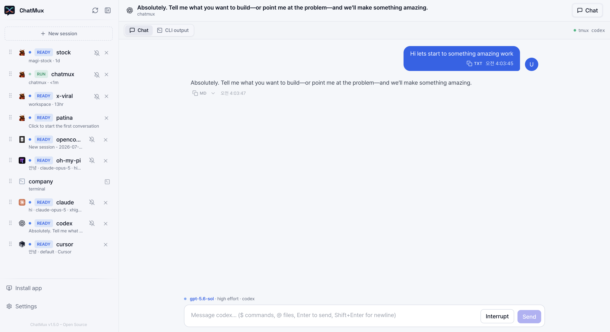
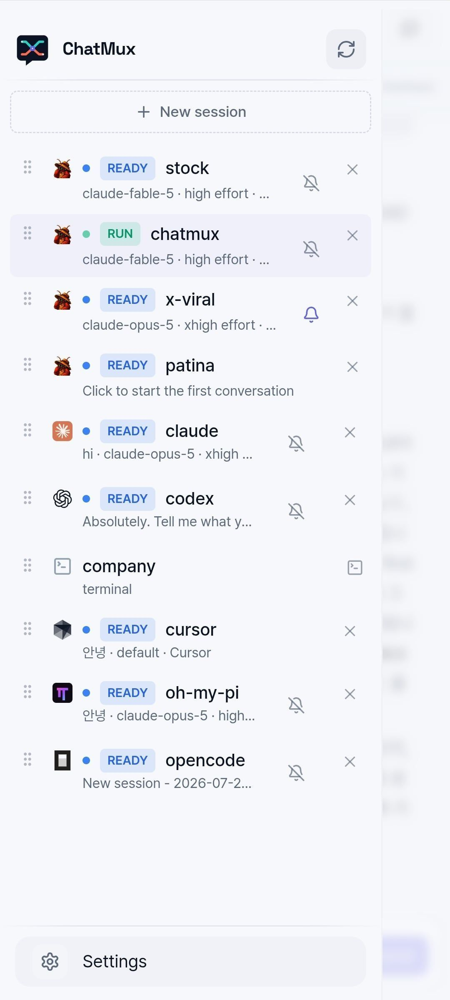
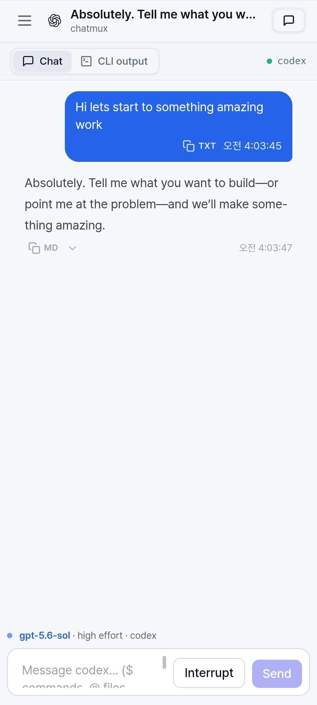
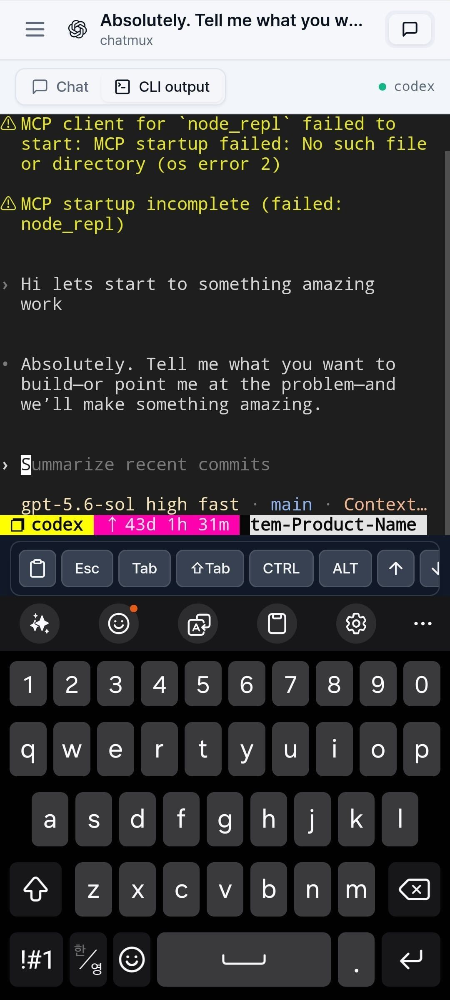

<p align="center">
  
</p>

<p align="center"><sub><a href="../../README.md">English</a> · <a href="README.ko.md">한국어</a> · <b>日本語</b> · <a href="README.zh-CN.md">简体中文</a></sub></p>

<p align="center">Claude Code、Codex、Cursor、OpenCode、Gajae Code、Oh My Pi、Oh My OpenAgent のためのひとつのインターフェース —<br>tmux ですでに動いているエージェントをまとめて管理できます。</p>

<p align="center">
  <a href="https://github.com/devswha/chatmux/releases"></a>
  <a href="../../LICENSE"></a>
  
  
</p>

コーディングエージェント — Gajae Code、Claude Code、Codex、Cursor CLI、OpenCode、Oh My Pi、Oh My OpenAgent — は、これまでどおり tmux の中で動かします。ChatMux が自動で見つけ出し、デスクトップからでもスマホからでも、すべてのセッションをブラウザの 1 ページに表示します。

- **登録不要:** tmux ですでに動いているエージェントがサイドバーにそのまま現れます。ラップも配線も再起動も不要です。
- **マルチプロバイダー:** すべてのプロバイダーを、ドラッグで並べ替えられるひとつのリストにまとめ、ライブ状態を `RUN`、`READY`、`ERROR` バッジで表示します。
- **チャットまたはターミナル:** 認識された履歴は会話として読め、それ以外は実際に接続されたターミナルになります。入力は ChatMux が同一性を検証した pane にしか届きません。
- **スマホ対応:** Tailscale または LAN パスワード経由でインストールできる PWA。全セッション一覧、会話、キーバー付きの本物の TUI を利用できます。
- **主導権は tmux に:** ChatMux はいつでも再起動・削除できます。tmux のセッションは影響を受けずに動き続けます。

ChatMux に AI サブスクリプションは含まれません。ChatMux を実行するのと同じ OS ユーザーで、各エージェント CLI をインストールしてログインしてください。

## はじめに

```bash
curl -fsSL https://github.com/devswha/chatmux/releases/latest/download/install.sh | bash
```

Linux x86_64 (glibc 2.35+)、tmux、ユーザーレベルの systemd、`curl`/`tar`/`sha256sum` が必要です。

インストーラーは正規のリリースアーカイブをダウンロードして SHA-256 を検証し、ユーザーレベルのサービスを起動してアドレスを表示します。スマホ用の QR コードも表示されます。`chatmux status` でいつでも再表示できます。

<p align="center">
  
</p>

バージョン固定、アクセスモード、アップデート、ロールバック、リカバリについては[インストールガイド](../INSTALL.md)を参照してください。

## ブラウザで

表示された `Local` アドレスを開くと、動作中の tmux エージェントがサイドバーに自動で現れます。認識された履歴を持つセッションは、コンポーザー付きの構造化された会話として表示されます:

<p align="center">
  
</p>

同じセッションの `CLI output` タブは、tmux 内で実際に動いている TUI をブラウザにそのまま描画します — メニュープロンプトに答え、生の出力を見守り、実際のキー入力で操作できます:

<p align="center">
  
</p>

## スマホで

スマホで Tailscale をオンにし、インストール出力の QR コードをスキャンして、アプリ内の **Install app** ボタンで ChatMux を PWA として保存します:

<table align="center">
  <tr>
    <td align="center">
      <br>
      <sub>全セッション一覧</sub>
    </td>
    <td align="center">
      <br>
      <sub>会話ビュー</sub>
    </td>
    <td align="center">
      <br>
      <sub>キーバー付きの本物の TUI</sub>
    </td>
  </tr>
</table>

## エージェント対応

以下の「チャットビュー」は、セッションがコンポーザー付きの読みやすい会話として表示されることを意味します。それ以外は ChatMux が接続したターミナルになります。どちらのビューからも実際の pane に入力できます。

| エージェント | 自動検出 | チャットビュー | 入力送信 | 新規セッションの開始 |
|---|:---:|---|---|:---:|
| **Gajae Code (GJC)** | はい | はい | プロンプトと `/` コマンド | はい |
| **Codex CLI** | はい | 履歴のインデックス後 | プロンプトと `$` スキル | はい |
| **Claude Code** | はい | 履歴のインデックス後 | プロンプトと `/` スキル | はい |
| **Cursor CLI** | はい | 履歴のインデックス後 | プロンプトと `/` スキル | はい |
| **OpenCode** | はい | 履歴のインデックス後 | プロンプトと `/` スキル | はい |
| **Oh My Pi** | はい | 履歴のインデックス後 | プロンプトと `/skill:` スキル | はい |
| **Oh My OpenAgent** (`omo`) | はい | 履歴のインデックス後 | プロンプトと `/skill:` スキル | はい |
| **SSH tmux** | はい | いいえ — ターミナルのみ | ターミナルのキー入力 | いいえ |
| **Local shell** | はい | いいえ — ターミナルのみ | ターミナルのキー入力 | いいえ |

<sub>Cursor セッションはドキュメントに記載された <code>agent</code> コマンドを使用します。古いインストール向けにレガシーの <code>cursor-agent</code> エイリアスも引き続きサポートされます。</sub>

## リモートアクセス

Tailscale にログイン済みなら、インストーラーが Tailscale Serve を自動で構成します: 承認済みの tailnet アカウントはパスワードなしでプライベート HTTPS アドレスを使え、それ以外はすべて拒否されます。Tailscale がない場合は、ワンタイムのオーナーパスワードによる LAN パスワードアクセスが有効になります:

```bash
chatmux access password             # 再発行/復旧（全セッションをサインアウト）
chatmux access enable tailscale     # Tailscale 準備後にモード切り替え
```

ユーザー許可リスト、長時間セッション、VPN モード、SSH トンネル、公開 TLS のオプションについては[リモートアクセスガイド](../REMOTE-ACCESS.md)を参照してください。

## CLI

インストール済みサービスは `chatmux` コマンドで管理します:

```bash
chatmux status                  # バージョン、アドレス、データの場所
chatmux access users            # 許可された Tailscale アカウント
chatmux access allow user@example.com
chatmux sandbox ~/my-project    # Docker サンドボックス内で実行
```

## セキュリティとデータ境界

- ChatMux は tmux のプロセス系譜をネイティブ履歴の識別子と結び付けます。作業ディレクトリが一致するだけでは破壊的な操作は決して許可されず、中継や終了の前に tmux セッション識別子を再検証します。
- バックエンドはループバックにバインドされます。Tailscale モードは、期待する HTTPS オリジンのループバックから来た Serve の識別ヘッダーだけを信頼します。インストーラーは Funnel や公開リスナーを決して有効にせず、未承認ユーザーは fail closed で拒否されます。
- パスワードモードは `HttpOnly`、`SameSite=Strict` Cookie と永続的なログアウト無効化を使用します。
- 状態とインデックスは `~/.chatmux` 以下にあります。移行やアップグレードの前に `~/.chatmux/data` をバックアップしてください。

## 開発

```bash
git clone https://github.com/devswha/chatmux.git
cd chatmux
npm ci
npm run dev
```

<http://127.0.0.1:5173> を開いてください。開発には Node.js `22.22.2+`（22.x 系）または `24.15.0+`（24.x 系）、npm、Git、tmux、Rust `1.85.1` が必要です。`npm run verify` はフルのリリースゲートを実行します: 監査、型チェック、Rust チェック、テスト、リント、識別子チェック、プロダクションビルド。

## ドキュメント

- [本番インストール](../INSTALL.md)
- [リモートアクセス](../REMOTE-ACCESS.md)
- [セルフホスト運用](../SELF-HOST.md)
- [プロダクトの範囲とロードマップ](../ROADMAP.md)
- [アップストリームの由来](../UPSTREAM.md)
- [コントリビュート](../../CONTRIBUTING.md)
- [イシュートラッカー](https://github.com/devswha/chatmux/issues)

## ライセンス

[AGPL-3.0](../../LICENSE) · tmux に住む人たちのために
