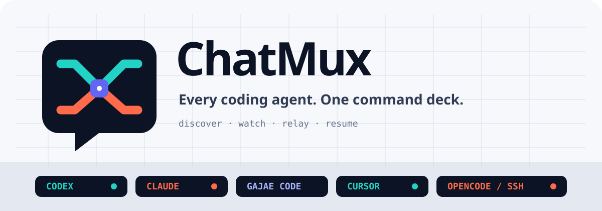
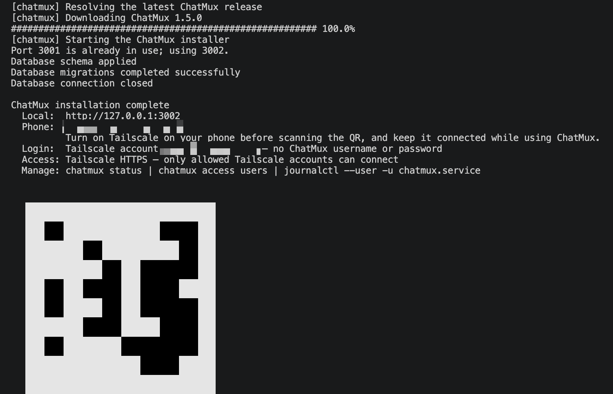
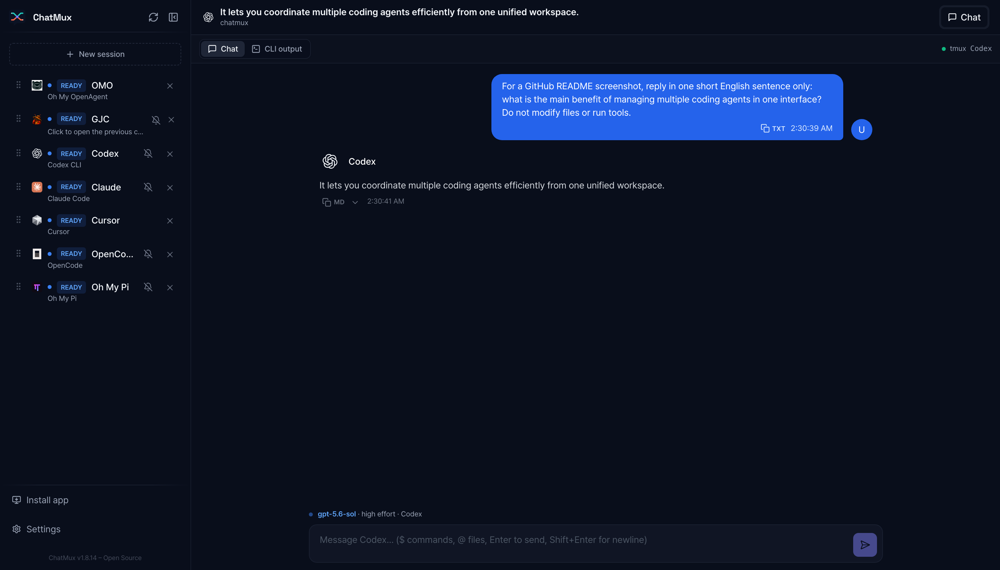
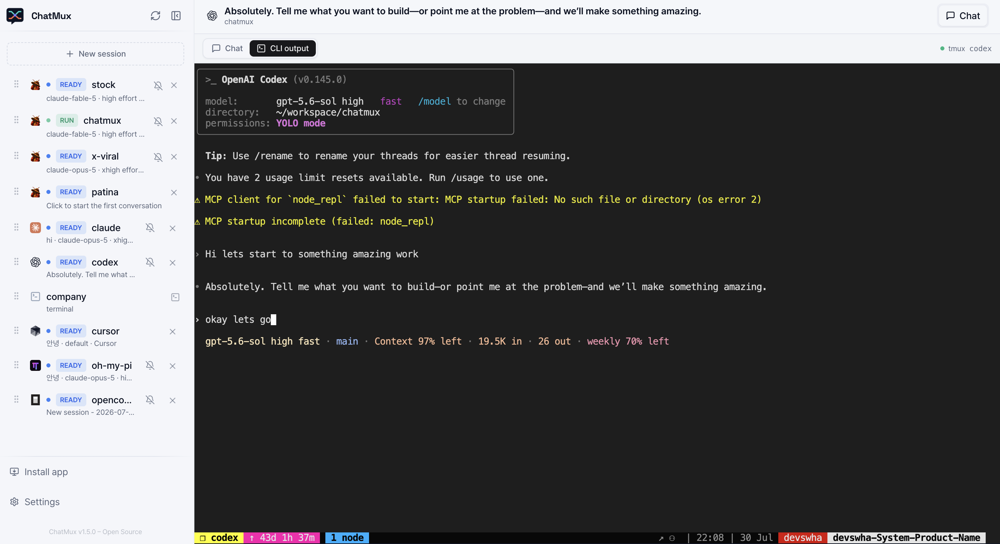
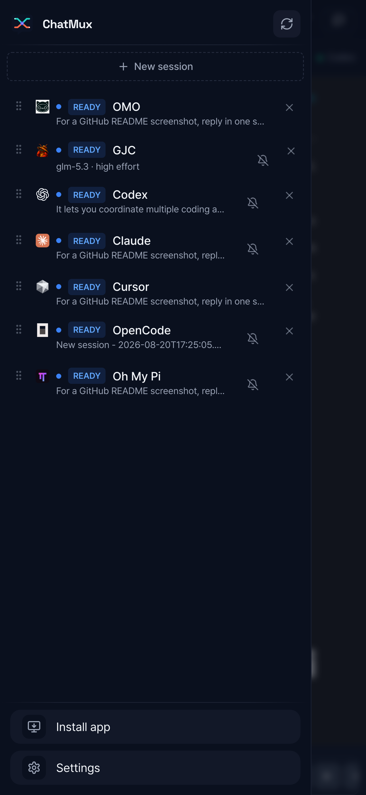
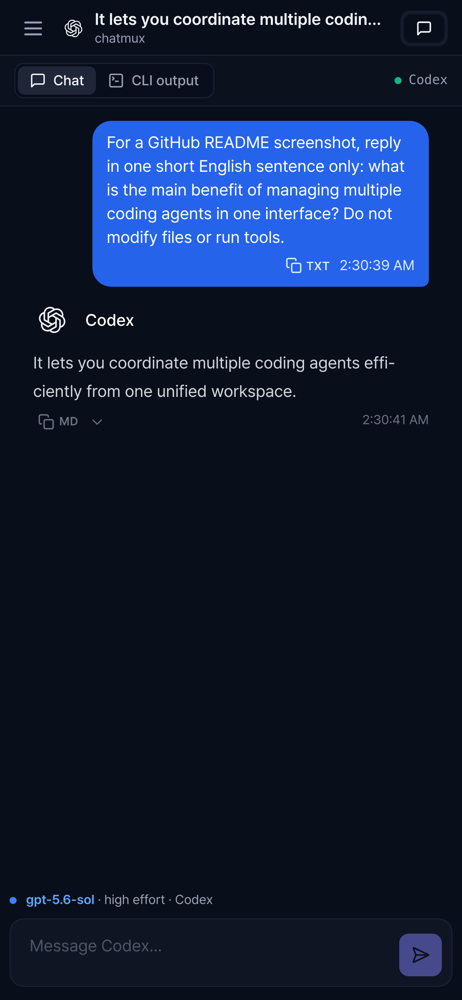
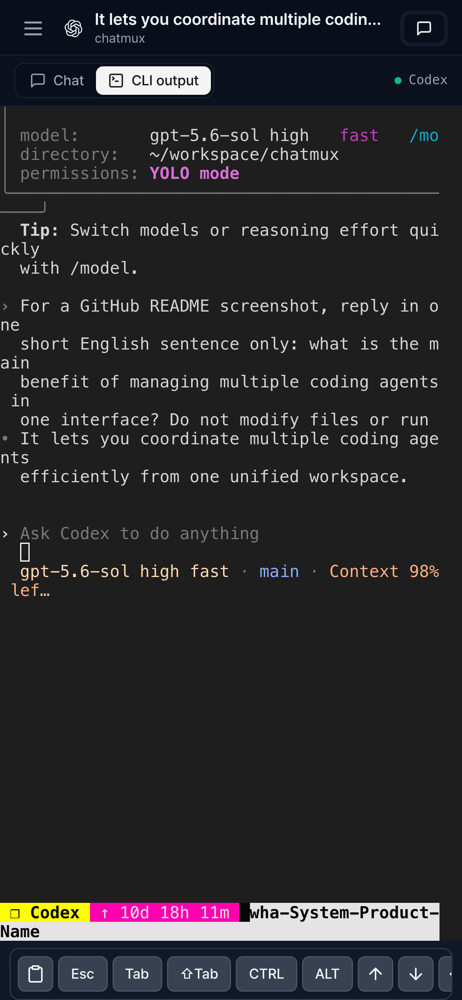

<p align="center">
  
</p>

<p align="center"><sub><a href="../../README.md">English</a> · <b>한국어</b> · <a href="README.ja.md">日本語</a> · <a href="README.zh-CN.md">简体中文</a></sub></p>

<p align="center">Claude Code, Codex, OpenCode 등을 하나의 인터페이스에서 —<br>tmux에서 실행 중인 에이전트를 그대로 연결합니다.</p>

<p align="center">
  <a href="https://github.com/devswha/chatmux/releases"></a>
  <a href="../../LICENSE"></a>
  
  
</p>

Oh My OpenAgent, Gajae Code, Claude Code, Codex, Cursor CLI, OpenCode, Oh My Pi 같은 코딩 에이전트를 늘 하던 대로 tmux 안에서 실행하세요. ChatMux가 알아서 찾아 데스크톱이나 휴대폰에서 모든 세션을 하나의 브라우저 페이지에 보여줍니다.

- **등록 절차 없음:** tmux에서 이미 실행 중인 에이전트가 사이드바에 바로 나타납니다. 감싸거나 연결하거나 재시작할 것이 없습니다.
- **멀티 프로바이더:** 모든 프로바이더가 드래그로 정렬할 수 있는 하나의 목록에 모이고, `RUN`, `READY`, `ERROR` 배지로 실시간 상태를 보여줍니다.
- **채팅 또는 터미널:** 기록이 인식된 세션은 대화로 읽히고, 나머지는 실제 연결된 터미널입니다. 입력은 ChatMux가 신원을 확인한 pane에만 전달됩니다.
- **휴대폰 지원:** Tailscale 또는 LAN 비밀번호로 설치 가능한 PWA이며, 전체 목록과 대화, 키 바가 있는 실제 TUI를 제공합니다.
- **tmux가 계속 주도:** ChatMux를 언제든 재시작하거나 제거해도 tmux 세션은 건드리지 않고 계속 실행됩니다.

ChatMux에는 AI 구독이 포함되지 않습니다. ChatMux를 실행하는 동일한 OS 사용자로 각 에이전트 CLI를 설치하고 로그인하세요.

## 시작하기

```bash
curl -fsSL https://github.com/devswha/chatmux/releases/latest/download/install.sh | bash
```

Linux x86_64(glibc 2.35+)와 tmux, 사용자 레벨 systemd, `curl`/`tar`/`sha256sum`이 필요합니다.

인스톨러는 정식 릴리즈 아카이브를 내려받아 SHA-256을 검증하고, 사용자 레벨 서비스를 시작한 뒤 접속 주소와 휴대폰용 QR 코드를 출력합니다. `chatmux status`로 언제든 다시 확인할 수 있습니다.

<p align="center">
  
</p>

버전 고정, 접근 모드, 업데이트, 롤백, 복구는 [설치 가이드](../INSTALL.md)에서 다룹니다.

## 브라우저에서

출력된 `Local` 주소를 여세요. 실행 중인 tmux 에이전트가 사이드바에 자동으로 나타납니다. 기록이 인식된 세션은 컴포저가 있는 구조화된 대화로 렌더링됩니다:

<p align="center">
  
</p>

같은 세션의 `CLI output` 탭은 tmux 안에서 실행되는 실제 TUI를 브라우저에 렌더링합니다. 메뉴 프롬프트에 답하고, 원본 출력을 확인하거나, 실제 키 입력으로 직접 조작하세요:

<p align="center">
  
</p>

## 휴대폰에서

휴대폰에서 Tailscale을 켜고 설치 출력의 QR 코드를 스캔한 다음, 앱 안의 **Install app** 버튼으로 ChatMux를 PWA로 설치하세요:

<table align="center">
  <tr>
    <td align="center">
      <br>
      <sub>전체 세션 목록</sub>
    </td>
    <td align="center">
      <br>
      <sub>대화 뷰</sub>
    </td>
    <td align="center">
      <br>
      <sub>키 바가 있는 실제 TUI</sub>
    </td>
  </tr>
</table>

## 에이전트 지원

아래 에이전트는 모두 자동으로 발견되며 직접 입력과 ChatMux에서의 새 세션 시작을 지원합니다. 인덱싱된 히스토리는 대화로 표시되고, 실시간 CLI 출력은 언제든 볼 수 있습니다.

| 에이전트 | 채팅 뷰 |
|---|---|
| **Claude Code** | 히스토리 인덱싱 후 |
| **Codex CLI** | 히스토리 인덱싱 후 |
| **Cursor CLI** | 히스토리 인덱싱 후 |
| **OpenCode** | 히스토리 인덱싱 후 |
| **Oh My OpenAgent** (`omo`) | 히스토리 인덱싱 후 |
| **Oh My Pi** | 히스토리 인덱싱 후 |
| **Gajae Code (GJC)** | 기본 지원 |

SSH tmux와 로컬 셸도 터미널 전용 연결로 지원합니다.

<sub>Cursor 세션은 문서화된 <code>agent</code> 명령을 사용합니다. 구형 설치를 위한 레거시 <code>cursor-agent</code> 별칭도 계속 지원됩니다.</sub>

## 원격 접속

Tailscale에 로그인되어 있으면 인스톨러가 Tailscale Serve를 자동으로 구성합니다. 승인된 tailnet 계정은 별도 비밀번호 없이 비공개 HTTPS 주소를 사용하고, 그 외 사용자는 거부됩니다. Tailscale이 없으면 설치 시 일회용 소유자 비밀번호와 함께 LAN 비밀번호 접속을 활성화합니다:

```bash
chatmux access password             # 교체/복구 (모든 세션 로그아웃)
chatmux access enable tailscale     # Tailscale을 사용할 수 있게 된 후 모드 전환
```

사용자 허용 목록, 더 긴 세션, VPN 모드, SSH 터널, 공개 TLS 옵션은 [원격 접속 가이드](../REMOTE-ACCESS.md)에서 다룹니다.

## CLI

`chatmux` 명령은 설치된 서비스를 관리합니다:

```bash
chatmux status                  # 버전, 주소, 데이터 위치
chatmux access users            # 허용된 Tailscale 계정
chatmux access allow user@example.com
chatmux sandbox ~/my-project    # Docker 샌드박스 안에서 실행
```

## 보안 및 데이터 경계

- ChatMux는 tmux 프로세스 계보를 네이티브 기록 식별자에 연결합니다. 작업 디렉터리가 일치하는 것만으로는 파괴적 동작을 허가하지 않으며, 릴레이 또는 종료 전에 tmux 세션 식별자를 다시 확인합니다.
- 백엔드는 루프백에 바인딩됩니다. Tailscale 모드는 예상 HTTPS 오리진의 루프백에서 온 Serve 신원 헤더만 신뢰하며, 인스톨러는 Funnel이나 공개 리스너를 활성화하지 않고, 승인되지 않은 사용자는 기본 거부됩니다.
- 비밀번호 모드는 `HttpOnly`, `SameSite=Strict` 쿠키와 지속적인 로그아웃 무효화를 사용합니다.
- 상태와 인덱스는 `~/.chatmux` 아래에 저장됩니다. 마이그레이션 또는 업그레이드 전에 `~/.chatmux/data`를 백업하세요.

## 개발

```bash
git clone https://github.com/devswha/chatmux.git
cd chatmux
npm ci
npm run dev
```

<http://127.0.0.1:5173>을 여세요. 개발에는 22.x 라인의 Node.js `22.22.2+` 또는 24.x 라인의 `24.15.0+`, npm, Git, tmux, Rust `1.85.1`이 필요합니다. `npm run verify`는 감사, 타입체크, Rust 검사, 테스트, 린트, 신원 검사, 프로덕션 빌드를 포함한 전체 릴리즈 게이트를 실행합니다.

## 문서

- [프로덕션 설치](../INSTALL.md)
- [원격 접속](../REMOTE-ACCESS.md)
- [셀프호스트 운영](../SELF-HOST.md)
- [제품 범위와 로드맵](../ROADMAP.md)
- [업스트림 출처](../UPSTREAM.md)
- [기여하기](../../CONTRIBUTING.md)
- [이슈 트래커](https://github.com/devswha/chatmux/issues)

## 라이선스

[AGPL-3.0](../../LICENSE) · tmux에서 살아가는 사람들을 위해
