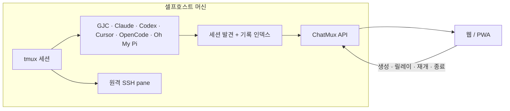

<p align="center">
  
</p>

<p align="center"><sub><a href="../../README.md">English</a> · <b>한국어</b> · <a href="README.ja.md">日本語</a> · <a href="README.zh-CN.md">简体中文</a></sub></p>

<p align="center"><b>ChatMux</b>는 tmux에서 돌아가는 코딩 에이전트 세션을 발견하고, 읽고, 조작하는<br>셀프호스트 웹 인터페이스입니다 — 데스크톱에서도, 폰에서도.</p>

<p align="center">
  <a href="https://github.com/devswha/chatmux/releases"></a>
  <a href="../../LICENSE"></a>
  
  
</p>

<p align="center">
  <a href="#install"><b>설치</b></a>
  &nbsp;·&nbsp;
  <a href="#browser"><b>브라우저</b></a>
  &nbsp;·&nbsp;
  <a href="#mobile"><b>모바일</b></a>
  &nbsp;·&nbsp;
  <a href="#agent-support"><b>에이전트 지원</b></a>
  &nbsp;·&nbsp;
  <a href="#remote-access"><b>원격 접속</b></a>
  &nbsp;·&nbsp;
  <a href="../INSTALL.md"><b>문서</b></a>
</p>

<br>

Gajae Code, Claude Code, Codex, Cursor CLI, OpenCode, Oh My Pi — 코딩
에이전트는 지금처럼 tmux 안에서 돌리세요. ChatMux가 알아서 찾아내 모든
세션을 브라우저 한 페이지에 보여줍니다:

<table align="center">
  <tr>
    <td width="50%" valign="top">
      <b>등록 절차 없음</b><br>
      <sub>tmux에서 이미 돌고 있는 에이전트가 사이드바에 그냥 나타납니다. 감싸거나, 연결하거나, 재시작할 것이 없습니다.</sub>
    </td>
    <td width="50%" valign="top">
      <b>하나의 정렬된 사이드바</b><br>
      <sub>모든 프로바이더가 드래그로 정렬되는 하나의 목록에 모이고, <code>RUN</code>·<code>READY</code>·<code>ERROR</code> 배지로 라이브 상태를 보여줍니다.</sub>
    </td>
  </tr>
  <tr>
    <td width="50%" valign="top">
      <b>채팅 또는 터미널</b><br>
      <sub>기록이 인식된 세션은 대화로 읽히고, 나머지는 진짜 터미널로 붙습니다. 입력은 ChatMux가 신원을 검증한 pane에만 전달됩니다.</sub>
    </td>
    <td width="50%" valign="top">
      <b>주도권은 tmux에</b><br>
      <sub>ChatMux는 언제든 재시작하거나 지워도 됩니다. tmux 세션은 그대로 계속 돌아갑니다.</sub>
    </td>
  </tr>
</table>

<p align="center"><sub>ChatMux에 AI 구독은 포함되지 않습니다 — 각 에이전트 CLI는 ChatMux를 돌리는 OS 사용자로 설치·로그인하세요.</sub></p>

<a id="install"></a>
## 설치

Linux x86_64(glibc 2.35+), tmux, 사용자 레벨 systemd, `curl`/`tar`/`sha256sum`이
필요합니다:

```bash
curl -fsSL https://github.com/devswha/chatmux/releases/latest/download/install.sh | bash
```

<p align="center">
  
  <br>
  <sub>명령 한 줄로: 검증된 다운로드, 사용자 레벨 서비스, 접속 주소, 폰을 위한 QR까지.</sub>
</p>

인스톨러는 정식 릴리즈 아카이브를 내려받아 SHA-256을 검증하고, 사용자
레벨 서비스를 시작한 뒤 접속 주소를 출력합니다. 주소는 `chatmux status`로
언제든 다시 볼 수 있습니다. 버전 고정, 접근 모드, 업데이트, 롤백, 복구는
[설치 가이드](../INSTALL.md)에서, 소스 개발은 [개발](#development)에서
다룹니다.

<a id="browser"></a>
## 브라우저

출력된 `Local` 주소를 열면 — 돌고 있는 tmux 에이전트가 사이드바에 알아서
나타납니다. 기록이 인식된 세션은 컴포저가 달린 구조화된 대화로 렌더링됩니다:

<p align="center">
  
  <br>
  <sub>대화 뷰: 왼쪽은 프로바이더 통합 사이드바, 오른쪽은 구조화된 기록과 컴포저.</sub>
</p>

같은 세션의 `CLI output` 탭은 tmux 안에서 실제로 돌고 있는 TUI를
브라우저에 그대로 렌더링합니다 — 메뉴 프롬프트에 답하고, 원본 출력을
지켜보고, 실제 키 입력으로 직접 조작하세요:

<p align="center">
  
  <br>
  <sub>같은 세션을 진짜 터미널로 — 결국 실제 TUI가 필요한 순간이 있으니까.</sub>
</p>

<a id="mobile"></a>
## 모바일

폰에서 Tailscale을 켜고, 설치 출력의 QR 코드를 스캔한 뒤, 앱 안의
**Install app** 버튼으로 ChatMux를 PWA로 설치하세요:

<table align="center">
  <tr>
    <td align="center">
      <br>
      <sub>전체 세션 목록</sub>
    </td>
    <td align="center">
      <br>
      <sub>대화 뷰</sub>
    </td>
    <td align="center">
      <br>
      <sub>키 바가 달린 진짜 TUI</sub>
    </td>
  </tr>
</table>

<a id="agent-support"></a>
## 에이전트 지원

아래에서 "채팅 뷰"는 세션이 컴포저가 달린 읽기 좋은 대화로 렌더링된다는
뜻입니다. 그 외에는 터미널로 붙습니다. 두 뷰 모두 실제 pane에 입력할 수
있습니다.

| 에이전트 | 자동 발견 | 채팅 뷰 | 입력 전송 | 새 세션 시작 |
|---|:---:|---|---|:---:|
| **Gajae Code (GJC)** | 예 | 예 | 프롬프트와 `/` 명령 | 예 |
| **Codex CLI** | 예 | 히스토리 인덱싱 후 | 프롬프트와 `$` 스킬 | 예 |
| **Claude Code** | 예 | 히스토리 인덱싱 후 | 프롬프트와 `/` 스킬 | 예 |
| **Cursor CLI** | 예 | 히스토리 인덱싱 후 | 프롬프트와 `/` 스킬 | 예 |
| **OpenCode** | 예 | 히스토리 인덱싱 후 | 프롬프트와 `/` 스킬 | 예 |
| **Oh My Pi** | 예 | 히스토리 인덱싱 후 | 프롬프트와 `/skill:` 스킬 | 예 |
| **SSH tmux** | 예 | 아니오 — 터미널 전용 | 터미널 키 입력 | 아니오 |
| **로컬 셸** | 예 | 아니오 — 터미널 전용 | 터미널 키 입력 | 아니오 |

<sub>Cursor 세션은 공식 <code>agent</code> 명령을 사용합니다. 구버전 설치를 위해 레거시 <code>cursor-agent</code> 별칭도 계속 지원됩니다.</sub>

<a id="remote-access"></a>
## 원격 접속

Tailscale에 로그인돼 있으면 인스톨러가 Tailscale Serve를 자동으로
구성합니다: 승인된 테일넷 계정은 별도 비밀번호 없이 프라이빗 HTTPS 주소를
쓰고, 그 외에는 전부 거부됩니다. Tailscale이 없으면 설치 시 일회용 소유자
비밀번호와 함께 LAN 비밀번호 접속이 켜집니다:

```bash
chatmux access password              # 재발급/복구 (모든 세션 로그아웃)
chatmux access enable tailscale     # Tailscale 준비 후 모드 전환
```

사용자 허용 목록, 세션 연장, VPN 모드, SSH 터널, 공개 TLS 옵션은
[원격 접속 가이드](../REMOTE-ACCESS.md)와 [설치 가이드](../INSTALL.md)에서
다룹니다.

## 동작 원리



ChatMux는 tmux 프로세스 계보를 네이티브 기록 식별자와 연결합니다. 작업
디렉토리가 일치한다는 것만으로는 파괴적 동작이 절대 허가되지 않으며,
릴레이나 종료 전에 tmux 세션 식별자를 다시 검증합니다.

<a id="development"></a>
## 개발

```bash
git clone https://github.com/devswha/chatmux.git
cd chatmux
npm ci
npm run dev
```

<http://127.0.0.1:5173>을 여세요. 개발에는 Node.js 22.x 라인 `22.22.2+`
또는 24.x 라인 `24.15.0+`, npm, Git, tmux, Rust `1.85.1`이 필요합니다.
`npm run verify`는 전체 릴리즈 게이트를 실행합니다: 감사, 타입체크, Rust
검사, 테스트, 린트, 아이덴티티 검사, 프로덕션 빌드.

## 보안과 데이터 경계

- 백엔드는 루프백에 바인딩됩니다. Tailscale 모드는 기대한 HTTPS 오리진의
  루프백에서 온 Serve 신원 헤더만 신뢰하고, 인스톨러는 Funnel이나 공개
  리스너를 절대 켜지 않으며, 미승인 사용자는 차단으로 실패합니다.
- 비밀번호 모드는 `HttpOnly`, `SameSite=Strict` 쿠키와 영구 로그아웃
  무효화를 사용합니다.
- 상태와 인덱스는 `~/.chatmux` 아래에 있습니다. 마이그레이션이나 업그레이드
  전에 `~/.chatmux/data`를 백업하세요.

## 문서

- [프로덕션 설치](../INSTALL.md)
- [원격 접속](../REMOTE-ACCESS.md)
- [셀프호스트 운영](../SELF-HOST.md)
- [제품 범위와 로드맵](../ROADMAP.md)
- [업스트림 출처](../UPSTREAM.md)
- [기여하기](../../CONTRIBUTING.md)
- [이슈 트래커](https://github.com/devswha/chatmux/issues)

<p align="center">
  <sub><a href="../../LICENSE">GNU AGPL v3</a> · tmux에서 사는 사람들을 위해</sub>
</p>
