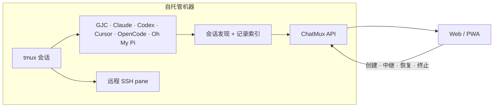

<p align="center">
  
</p>

<p align="center"><sub><a href="../../README.md">English</a> · <a href="README.ko.md">한국어</a> · <a href="README.ja.md">日本語</a> · <b>简体中文</b></sub></p>

<p align="center"><b>ChatMux</b> 是一个自托管的 Web 界面，用于发现、阅读并控制运行在 tmux 中的<br>编码代理会话 — 在桌面或手机上都可以。</p>

<p align="center">
  <a href="https://github.com/devswha/chatmux/releases"></a>
  <a href="../../LICENSE"></a>
  
  
</p>

<p align="center">
  <a href="#install"><b>安装</b></a>
  &nbsp;·&nbsp;
  <a href="#browser"><b>浏览器</b></a>
  &nbsp;·&nbsp;
  <a href="#mobile"><b>移动端</b></a>
  &nbsp;·&nbsp;
  <a href="#agent-support"><b>代理支持</b></a>
  &nbsp;·&nbsp;
  <a href="#remote-access"><b>远程访问</b></a>
  &nbsp;·&nbsp;
  <a href="../INSTALL.md"><b>文档</b></a>
</p>

<br>

你照常在 tmux 里运行编码代理 — Gajae Code、Claude Code、Codex、Cursor
CLI、OpenCode、Oh My Pi。ChatMux 会自动发现它们，并把所有会话显示在一个
浏览器页面里:

<table align="center">
  <tr>
    <td width="50%" valign="top">
      <b>无需注册</b><br>
      <sub>已经在 tmux 里运行的代理会直接出现在侧边栏。不用包装、不用接线、不用重启。</sub>
    </td>
    <td width="50%" valign="top">
      <b>一个有序的侧边栏</b><br>
      <sub>所有提供方汇入一个可拖拽排序的列表，<code>RUN</code>、<code>READY</code>、<code>ERROR</code> 徽章实时反映状态。</sub>
    </td>
  </tr>
  <tr>
    <td width="50%" valign="top">
      <b>聊天或终端</b><br>
      <sub>能识别记录的会话以对话形式呈现；其余则是真实的附加终端。输入只会送达 ChatMux 已验证身份的 pane。</sub>
    </td>
    <td width="50%" valign="top">
      <b>tmux 始终是主宰</b><br>
      <sub>随时重启或删除 ChatMux；你的 tmux 会话原样继续运行。</sub>
    </td>
  </tr>
</table>

<p align="center"><sub>ChatMux 不捆绑任何 AI 订阅 — 请以运行 ChatMux 的同一 OS 用户安装并登录各个代理 CLI。</sub></p>

<a id="install"></a>
## 安装

需要 Linux x86_64（glibc 2.35+）、tmux、用户级 systemd，以及
`curl`/`tar`/`sha256sum`:

```bash
curl -fsSL https://github.com/devswha/chatmux/releases/latest/download/install.sh | bash
```

<p align="center">
  
  <br>
  <sub>一条命令：经过校验的下载、用户级服务、访问地址，还有给手机的二维码。</sub>
</p>

安装器下载正式发布归档并校验其 SHA-256，启动用户级服务，然后打印访问
地址。随时可用 `chatmux status` 再次查看。版本锁定、访问模式、更新、
回滚与恢复见[安装指南](../INSTALL.md)；源码开发见[开发](#development)。

<a id="browser"></a>
## 浏览器

打开打印出的 `Local` 地址 — 正在运行的 tmux 代理会自动出现在侧边栏。
能识别记录的会话会渲染为带输入框的结构化对话:

<p align="center">
  
  <br>
  <sub>对话视图：左侧是跨提供方的侧边栏，右侧是结构化记录与输入框。</sub>
</p>

同一会话的 `CLI output` 标签页把真正运行在 tmux 里的 TUI 渲染到浏览器中 —
回应菜单提示、盯着原始输出，或用真实按键直接接管:

<p align="center">
  
  <br>
  <sub>同一个会话，真实的终端 — 因为总有需要真正 TUI 的时刻。</sub>
</p>

<a id="mobile"></a>
## 移动端

在手机上打开 Tailscale，扫描安装输出中的二维码，然后用应用内的
**Install app** 按钮把 ChatMux 保存为 PWA:

<table align="center">
  <tr>
    <td align="center">
      <br>
      <sub>完整会话总表</sub>
    </td>
    <td align="center">
      <br>
      <sub>对话视图</sub>
    </td>
    <td align="center">
      <br>
      <sub>带按键栏的真实 TUI</sub>
    </td>
  </tr>
</table>

<a id="agent-support"></a>
## 代理支持

下表中「聊天视图」指会话渲染为带输入框、易于阅读的对话；否则 ChatMux
提供附加终端。两种视图都能向真实 pane 输入。

| 代理 | 自动发现 | 聊天视图 | 发送输入 | 新建会话 |
|---|:---:|---|---|:---:|
| **Gajae Code (GJC)** | 是 | 是 | 提示词与 `/` 命令 | 是 |
| **Codex CLI** | 是 | 历史索引后 | 提示词与 `$` 技能 | 是 |
| **Claude Code** | 是 | 历史索引后 | 提示词与 `/` 技能 | 是 |
| **Cursor CLI** | 是 | 历史索引后 | 提示词与 `/` 技能 | 是 |
| **OpenCode** | 是 | 历史索引后 | 提示词与 `/` 技能 | 是 |
| **Oh My Pi** | 是 | 历史索引后 | 提示词与 `/skill:` 技能 | 是 |
| **SSH tmux** | 是 | 否 — 仅终端 | 终端按键 | 否 |
| **本地 shell** | 是 | 否 — 仅终端 | 终端按键 | 否 |

<sub>Cursor 会话使用官方的 <code>agent</code> 命令；为旧安装保留了 <code>cursor-agent</code> 兼容别名。</sub>

<a id="remote-access"></a>
## 远程访问

若已登录 Tailscale，安装器会自动配置 Tailscale Serve：获批的 tailnet
账户无需额外密码即可使用私有 HTTPS 地址，其余一律拒绝。没有 Tailscale
时，安装会启用带一次性所有者密码的局域网密码访问:

```bash
chatmux access password              # 轮换/找回（注销所有会话）
chatmux access enable tailscale     # Tailscale 就绪后切换模式
```

用户白名单、更长会话、VPN 模式、SSH 隧道与公网 TLS 选项见
[远程访问指南](../REMOTE-ACCESS.md)和[安装指南](../INSTALL.md)。

## 工作原理



ChatMux 将 tmux 进程谱系与原生记录标识符关联。仅凭工作目录一致绝不足以
授权破坏性操作，且在中继或终止之前都会重新核验 tmux 会话标识符。

<a id="development"></a>
## 开发

```bash
git clone https://github.com/devswha/chatmux.git
cd chatmux
npm ci
npm run dev
```

打开 <http://127.0.0.1:5173>。开发需要 Node.js 22.x 线 `22.22.2+` 或
24.x 线 `24.15.0+`、npm、Git、tmux 和 Rust `1.85.1`。`npm run verify`
运行完整的发布门禁：审计、类型检查、Rust 检查、测试、lint、身份检查和
生产构建。

## 安全与数据边界

- 后端绑定在环回地址。Tailscale 模式只信任来自预期 HTTPS 源环回的 Serve
  身份标头；安装器绝不会启用 Funnel 或公开监听器，未获批用户一律拒绝。
- 密码模式使用 `HttpOnly`、`SameSite=Strict` Cookie 与持久化的注销吊销。
- 状态与索引位于 `~/.chatmux` 之下。迁移或升级前请备份
  `~/.chatmux/data`。

## 文档

- [生产安装](../INSTALL.md)
- [远程访问](../REMOTE-ACCESS.md)
- [自托管运维](../SELF-HOST.md)
- [产品范围与路线图](../ROADMAP.md)
- [上游来源](../UPSTREAM.md)
- [参与贡献](../../CONTRIBUTING.md)
- [问题追踪](https://github.com/devswha/chatmux/issues)

<p align="center">
  <sub><a href="../../LICENSE">GNU AGPL v3</a> · 献给住在 tmux 里的人</sub>
</p>
